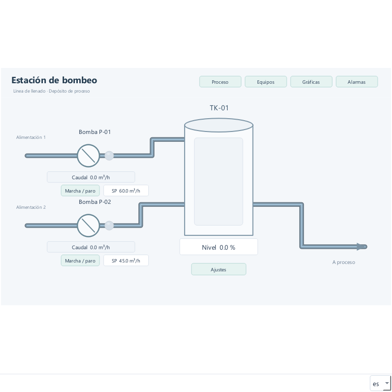

# abSCADA

SCADA de escritorio libre **GPL-3.0-or-later**, construido con Python y PySide6. Studio para diseñar proyectos y Runtime para operarlos en una ventana independiente, con comunicación Siemens S7 y Modbus TCP, alarmas persistentes, históricos SQLite y tendencias con varios ejes. Los proyectos son archivos JSON legibles y editables desde VS Code.




## Instalación

Desde la raíz del repositorio, con Python 3.11 o posterior:

```powershell
python -m venv .venv
.venv\Scripts\python -m pip install -e ".[dev,s7,modbus]"
.venv\Scripts\python -m abscada examples/plant
```

En Linux:

```bash
python3 -m venv .venv
.venv/bin/python -m pip install -e '.[dev,s7,modbus]'
.venv/bin/python -m abscada examples/plant
```

Qt necesita una sesión gráfica y las bibliotecas de sistema correspondientes a la distribución. En CI se utiliza `QT_QPA_PLATFORM=offscreen`. Verificado localmente en Windows con Python 3.14.3; la ejecución en Linux está pendiente. El workflow incluido ejecuta la misma suite en ambos sistemas cuando el repositorio se publique en GitHub.

## Ejecutable para Windows (beta)

```powershell
.venv\Scripts\python -m pip install -e ".[s7,modbus]" pyinstaller
.venv\Scripts\python packaging/build_exe.py
```

Genera `dist/abSCADA/abscada.exe` y `dist/abSCADA-<versión>-windows.zip`. El mismo proceso se ejecuta en GitHub Actions: **Actions → Windows build → Run workflow**, o al subir una etiqueta `v*`, que publica además una *release*. La guía para quien prueba la beta está en [docs/BETA.md](docs/BETA.md).

Los proyectos se abren desde su archivo `.abscada`. Sin argumentos se muestra una pantalla de inicio con proyectos recientes y ejemplos; `abscada --simulador hydro|ads|laboratorio|s7` arranca un PLC simulado.

## Diseñar y ejecutar

La [especificación de bibliotecas](docs/LIBRARY_AUTHORING_SPEC.md) detalla controles, propiedades y criterios de adaptación desde WinCC Unified.

**Bibliotecas de faceplates:** crea y publica componentes desde Studio, vincúlalos con un alias y actualiza sus versiones explícitamente desde **Bibliotecas…**. Cada proyecto conserva las plantillas y sus imágenes para funcionar sin el archivo original. Incluye [guía de bibliotecas](docs/FACEPLATE_LIBRARIES.md) y proyecto de autoría `examples/library_author`.

**Ejemplo completo:** [Laboratorio SCADA](examples/showcase/README.md), con 21 pantallas, variables internas, S7 y Modbus, todos los controles gráficos, faceplates, emergentes, alarmas, registros e históricos. Abre con `.\run.ps1 examples/showcase`. Su guía incluye los mapas PLC y las herramientas externas de prueba.

**Ejemplo industrial:** [CH Valdearenas](examples/hydro/README.md), SCADA de una central hidroeléctrica con dos grupos Francis de 10 MW: 23 pantallas, 173 variables, 3 PLC S7 y un contador Modbus, secuencias de arranque/parada, protecciones, unifilar de 66 kV, 43 alarmas, control de planta y ventanas de mando y alarmas para varios monitores. Arranca el simulador con `tools/hydro_plc.py` y abre `.\run.ps1 examples/hydro`.

**Beckhoff TwinCAT ADS:** cliente ADS propio, sin TwinCAT en el PC del SCADA. Acceso por símbolo (`MAIN.rVelocidad`) o por grupo:offset. Ejemplo en [examples/beckhoff](examples/beckhoff/README.md), que se prueba con `python -m abscada.ads_simulator`.

**Indicador analógico:** control `gauge` con esfera de 240°, semicírculo o termómetro, y zonas de aviso y alarma.

**Nuevo documento** ofrece Pantalla, Layout y Faceplate con nombre, título y dimensiones. **Guardar proyecto / Ctrl+S** guarda el conjunto. **Versiones…** activa el historial Git local; después cada guardado con cambios crea una versión. Consulta [creación y guardado](docs/PROJECT_WORKFLOW.md).

**Scripts y tareas** permite Python de inicio, apertura de pantalla, botones y tareas periódicas, con límite de ejecución y diagnóstico. Las fuentes permanecen en archivos `.py`. Consulta [la API y los eventos](docs/SCRIPTING.md).

1. Abre la demo en **abSCADA Studio**. La etiqueta **MODO DISEÑO** siempre permanece visible.
2. El explorador **Proyecto** reúne pantallas, faceplates, variables, conexiones y registros. **Objetos** permite seleccionar elementos de la pantalla, incluso cuando se solapan. Las herramientas de dibujo están debajo.
3. Las propiedades permanecen visibles. Sin selección se editan título, dimensiones, fondo, pantalla inicial y cuadrícula. Con un objeto seleccionado se editan sus propiedades. El primer clic selecciona; una pulsación posterior permite mover. Los ocho tiradores cambian el tamaño.
4. **Línea** se dibuja con dos clics. **Polilínea** y **Tubería** se dibujan por puntos; Enter, doble clic o botón derecho terminan el trazado. Esc cancela. Los vértices se arrastran o se editan desde el inspector. Hay color, grosor, estilo, flechas, rectángulos y elipses.
5. Usa **Orden**, **Alinear**, **Duplicar**, **Eliminar**, deshacer/rehacer, Ctrl+rueda, zoom porcentual y botón central para recorrer el lienzo. Las flechas mueven 1 px; Shift+flecha utiliza el paso de cuadrícula. Guarda con Ctrl+S. Doble clic en un faceplate abre su plantilla; sus parámetros se editan desde **Ajustes avanzados…**.
6. En **Variables**, **Tipos de datos** y **Conexiones**, usa los formularios para crear o editar definiciones. Las estructuras aparecen como grupos desplegables, incluidas las anidadas. El filtro abre los grupos con coincidencias. Usa **Enlace…** en cualquier campo para elegir conexión, ubicación, valor inicial y acceso sin JSON. Al crear una estructura, su valor inicial completo todavía se introduce como objeto JSON; después se edita por campos mediante formularios.
7. Pulsa **Abrir runtime**. Se abre otra ventana con la pantalla de operación, sin herramientas de ingeniería. Pulsa los botones o haz doble clic en una entrada para escribir valores.
8. Studio sigue abierto y permite continuar editando. Su lienzo no recibe valores iniciales ni valores en vivo: muestra marcadores `—` y pilotos neutros. Runtime utiliza una copia del proyecto tomada al iniciarlo; los cambios de diseño se verán después de cerrarlo y volverlo a abrir.
9. Cerrar la ventana Runtime detiene comunicaciones y cierra sus ventanas emergentes. **Mostrar runtime** en Studio enfoca la ejecución existente sin crear otra. Cerrar Studio también detiene su runtime.

**Layouts:** Nuevo documento → Layout crea una composición. Añade contenedores de pantalla, asigna sus nombres, dimensiones y pantalla inicial. Los botones de Abrir pantalla permiten seleccionar Abrir en → nombre del contenedor, Zona actual o Ventana completa. `examples/plant` inicia `main_layout`: `common_header` permanece arriba mientras `contenido` cambia entre proceso, equipos, gráficas y alarmas. Consulta [el editor de pantallas](docs/SCREEN_EDITOR.md) para el funcionamiento y los límites de composición.

Para abrir solo la operación, sin Studio:

```powershell
.venv\Scripts\python -m abscada examples/plant --runtime
```

El runtime no incluye simulador interno ni generación de valores. La Prueba visual es una previsualización aislada que no crea un runtime ni usa comunicaciones. Los proyectos de ejemplo usan Siemens S7 TCP y requieren un PLC disponible o el servidor de desarrollo ejecutado por separado. Sin conexión, las variables enlazadas se marcan bad y conservan su último valor; no se generan lecturas ficticias.

## PLC, DB y variables

Una **conexión** identifica el PLC: nombre, IP, rack, slot y puerto. El **DB se define en el enlace de cada variable**, no como un único DB de la conexión. La misma conexión puede usar varios DB. Las variables locales no llevan conexión ni dirección.

| Variable | PLC / conexión | Dirección PLC | Tipo |
| --- | --- | --- | --- |
| Motor.running | PLC_Principal | %DB1.DBX0.0 | bool |
| Motor.speed | PLC_Principal | %DB1.DBW2 | int |
| Tank.level | PLC_Principal | %DB2.DBD4 | float |

En **Variables**, despliega la estructura y pulsa **Enlace…** en el campo. El formulario permite seleccionar conexión, DB, byte, codificación y bit para BOOL. La columna Ubicación resume el enlace; los proyectos anteriores con direcciones de texto siguen siendo válidos. `%DB1.DBW0` es un entero de 16 bits en el DB1, byte 0. `%DB1.DBD4` usa 32 bits: REAL para variables float y DINT para variables int. Se admite mayúsculas o minúsculas y el prefijo `%` es opcional. Los nombres SCADA no son nombres simbólicos del programa PLC: el adaptador Siemens actual solo admite acceso absoluto a bloques DB.

## Arranque con PLC de desarrollo

En una primera terminal:

```powershell
.venv\Scripts\python -m abscada.s7_simulator
```

En una segunda:

```powershell
.venv\Scripts\python -m abscada examples/s7
```

El servidor escucha exclusivamente en `127.0.0.1:1102`. Abre **Conexiones** para ver la configuración. `examples/demo` y `examples/s7` usan el mismo mapa DB y la misma conexión S7 a localhost:1102. Para un PLC físico, cambia IP, rack, slot, puerto y direcciones según el equipo. Ver [conexiones S7](docs/S7.md) para preparar un PLC físico.

## Herramientas

```powershell
.venv\Scripts\python -m abscada examples/plant --validate
.venv\Scripts\python -m abscada examples/plant --headless --seconds 5
.venv\Scripts\python -m pytest -q
.venv\Scripts\python tools/capture_demo.py
```

## Documentación

- [Análisis y arquitectura](docs/ARCHITECTURE.md): decisiones, dependencias y extensiones.
- [Formato de proyecto](docs/PROJECT_FORMAT.md): tipos, enlaces, componentes y persistencia.
- [Siemens S7](docs/S7.md): mapa de memoria, configuración y límites.
- [Desarrollo y validación](docs/DEVELOPMENT.md): pruebas y flujo de contribución.
- [Resultados de validación](docs/VALIDATION.md): evidencia local y verificaciones pendientes.
- [Hoja de ruta](docs/ROADMAP.md): evolución hacia un SCADA más completo.

## Alcance actual

Incluye Studio y Runtime separados, caja de herramientas visible con clic y arrastrar/soltar, inspector de propiedades, cuadrícula, selección múltiple, duplicado/eliminación, deshacer/rehacer, zoom, redimensionado, preview de faceplates, formularios para variables/tipos/conexiones, condiciones y estados visuales, S7 DB y Modbus TCP. El núcleo de adquisición sigue funcionando sin GUI.

Scripts y tareas permite eventos de inicio, apertura de pantalla, botones y tareas periódicas en Python. Siguen pendientes faceplates anidados, permisos de usuario, empaquetado instalable y validación con un PLC físico. La nueva interfaz no implica que la adquisición a gran escala o el uso industrial estén validados.

## Licencia

El código propio se distribuye bajo **GNU GPL versión 3 o posterior**. Consulta [LICENSE](LICENSE). Las dependencias conservan sus respectivas licencias; PySide6/Qt y python-snap7 no se relicencian por este proyecto. La licencia del motor no decide automáticamente la licencia de los proyectos de usuario ni de sus imágenes. No se incorporan código ni recursos de AVEVA.

La interfaz mantiene nombres de campos, herramientas, estados de conexión y errores. Las instrucciones de uso están en esta documentación, no en banners dentro del editor.

## Modbus TCP y protocolos futuros

En Conexiones, selecciona **Modbus TCP** y configura host, puerto TCP, Unit ID, timeout y ciclo. En Variables → Enlace, selecciona esa conexión: el formulario muestra área, offset base 0, codificación y orden de bytes/registros. Holding Register 40001 de un manual corresponde al offset 0 del área holding registers; consulta la convención del fabricante. Coils son BOOL; discrete inputs e input registers son de solo lectura. No hay simulación interna.

Cada conexión tiene un trabajador, cliente, cola de escritura, ciclo y reconexión independientes. La adquisición se ejecuta fuera de Qt. El ciclo es un objetivo; la duración de las peticiones limita la frecuencia alcanzable.

El diseño para ampliar protocolos, incluyendo OPC UA y TwinCAT ADS, está descrito en [docs/PROTOCOLS.md](docs/PROTOCOLS.md). Esos dos protocolos todavía no están implementados.

## Funciones operativas (0.4)

El arranque sin argumentos y `./run.ps1` abren `examples/plant`, un proyecto que abre el layout `main_layout`, con cabecera compartida y el esquema de bombeo `process_design` en su contenedor, con alarmas de nivel/caudal, siete variables registradas, una tendencia de tres curvas con dos ejes y pantallas con visores incrustados. `examples/demo` y `examples/s7` conservan sus ejemplos básicos. Todos usan comunicación TCP externa, sin simulación interna.

- **Alarmas:** categorías y colores, prioridad, condición digital/numérica, umbral, histéresis, retardos, ACK, entrada/salida/reconocimiento y comentario de operador. Visores de pendientes, activas, histórico y eventos, con filtros, columnas configurables y CSV.
- **Registros:** ficheros con variables y frecuencia común. Cada variable pertenece a uno o ninguno. Rotación diaria en SQLite, retención configurable, calidad y fechas de adquisición/registro.
- **Tendencias:** curvas por variable, color/grosor, eje asociado, hasta ocho ejes, escalas fijas/automáticas, visibilidad independiente de curvas/ejes, cursor, zoom, consulta temporal y exportación de datos originales.
- **Persistencia:** alarmas y auditoría en `runtime/scada.sqlite3`; variables en `runtime/records/<registro>/AAAA-MM-DD.sqlite3`. Consultas entre días, WAL, escritores separados de PLC/Qt y recuperación de alarmas pendientes al reiniciar.

En **Registros** configura ficheros y frecuencias. En **Variables**, el desplegable **Registro** asigna cada variable. Añade **Tendencia** o **Alarmas** a una pantalla y pulsa **Configurar…** en sus propiedades. Las gráficas muestran tiempo real sin registro o históricos de días anteriores. Runtime muestra solo la pantalla diseñada; los botones con acción **Abrir pantalla** definen la navegación.


La guía de uso y los detalles de persistencia están en [OPERATIONS.md](docs/OPERATIONS.md). Todavía están pendientes autenticación/roles, redundancia, alarmas PLC nativas, shelving y validación de carga y equipos físicos.

La guía del editor y sus gestos está en [SCREEN_EDITOR.md](docs/SCREEN_EDITOR.md).


## Ingeniería visual y estados

**Condiciones y estados** configura visibilidad, habilitación y apariencia sin Python ni JSON. Hay colores de piloto por estado, paleta compartida con HEX/RGB, mandos momentáneos y valores al pulsar/soltar. La selección múltiple ofrece propiedades comunes; Objetos permite bloqueo, ocultación de diseño y grupos.

**Prueba visual** permite revisar valores y calidad sin conectar equipos. Los formularios conservan el borrador cuando hay errores, aceptan decimales con coma y crean estructuras anidadas campo a campo. **Revisar** localiza mandos incompletos y propiedades desconocidas.

- [Ejercicio de marcha/paro y guía de estados visuales](docs/VISUAL_STATES.md).
- [Resolución de los 16 puntos del informe de producto](docs/FERNANDO_REVIEW_RESOLUTION.md).
