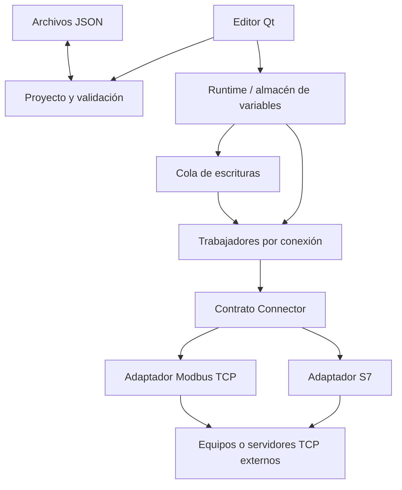

# Análisis y arquitectura

## Scripts, guardado y versiones

El Runtime posee ScriptService (scripting.py). Un coordinador serializa eventos y tareas; script_runner.py ejecuta cada fuente en otro proceso Python, con instantánea inicial y respuesta JSON. El proceso no recibe el objeto Runtime ni widgets. Las solicitudes válidas se canalizan por Runtime.write, conservando las reglas de acceso y las colas de cada conexión. La parada cancela el proceso activo antes de detener adquisición y archivo. Los contenedores delegan eventos de apertura y botones a su ventana; solo el runtime principal inicia el servicio.

automation_editor.py separa edición de fuentes, planificación y diagnóstico del editor gráfico. project_dialogs.py reúne creación de documentos y versiones. Se han retirado los editores JSON invisibles de tipos/conexiones y su antigua ruta de aplicación; los diálogos avanzados visibles siguen disponibles.

project_storage.py prepara el guardado conjunto, detecta ediciones externas, evita guardados concurrentes y revierte sustituciones ante errores de E/S. Las huellas de disco se conservan al deshacer después de guardar, para no confundir las escrituras propias con cambios externos. versioning.py limita los commits Git a fuentes del proyecto, sin incluir el contenido de runtime ni staging ajeno. La versión Git se crea después de guardar y su fallo no invalida los archivos guardados.

La nueva validación cubre sintaxis y referencias de scripts, periodos, timeout y permisos de escritura. El proceso Python no es una sandbox; los scripts de proyecto son código de confianza. El guardado de varios archivos tampoco promete atomicidad frente a cortes de alimentación. Ver SCRIPTING.md y PROJECT_WORKFLOW.md para semántica y límites.

## Objetivo

Crear un SCADA de escritorio multiplataforma con un editor gráfico y proyectos abiertos, manteniendo una frontera clara entre ingeniería, ejecución y comunicación industrial. Tomamos de las plataformas existentes los conceptos de variables, pantallas y componentes reutilizables, sin copiar implementación ni recursos.

## Decisiones iniciales

**Python + PySide6.** Qt aporta una escena gráfica con selección, movimiento y renderizado, además de controles de escritorio multiplataforma. PySide6 es el binding oficial de Qt. Python facilita integrar protocolos industriales y escribir pruebas del dominio sin interfaz. Usamos Qt Widgets y QGraphicsScene para este MVP; no obligamos al runtime a depender de Qt.

**Monolito modular.** Empezar con microservicios, una base de datos obligatoria o un framework de plugins complejo introduciría costes antes de validar el producto. La aplicación vive en un proceso, pero el núcleo no conoce la interfaz. La comunicación corre en un trabajador independiente por conexión y la GUI consume instantáneas bajo bloqueo.

**Proyectos JSON versionados.** `project.json` declara `schema_version=1`. Tipos, variables, conexiones, pantallas y faceplates tienen documentos separados. No se guardan objetos Qt, código Python serializado ni formatos binarios opacos. Las versiones desconocidas se rechazan. Las migraciones deberán ser explícitas, probadas y con copia previa.

**Conexiones y adaptadores.** La interfaz emplea “Conexiones”. El protocolo está encapsulado por el contrato `Connector`; el resto de la aplicación no debe conocer Snap7 ni direcciones DB. S7 y Modbus TCP aportan sus propias definiciones de configuración y enlace. OPC UA, ADS o MQTT deberán aportar sus esquemas y estrategias de adquisición; véase PROTOCOLS.md. La abstracción permite ampliar; no elimina las diferencias de seguridad, suscripción, descubrimiento y confirmación de cada protocolo.

## Capas

| Módulo | Responsabilidad | No debe conocer |
| --- | --- | --- |
| `project.py` | Carga, validación, coerción, expansión de estructuras y faceplates | Qt, sockets activos |
| `connectors.py` | Contrato, registro, definición y codificación S7 | Widgets, documentos gráficos |
| `protocol_definition.py` | Esquemas, validación y versión del enlace | Qt, sockets |
| `protocol_editor.py` | Formularios generados a partir de esquemas | Clientes industriales |
| `modbus.py` | Definición y cliente Modbus TCP | Qt, pantallas |
| `storage.py` | SQLite, consultas, retención y respaldo online | Qt, clientes PLC |
| `alarms.py` | Máquina de estados y retardos de alarmas | Qt, transporte |
| `operations.py` | Servicio escritor y registro periódico | Qt, clientes PLC |
| `engineering.py` | Configuración de alarmas, registros y visores | Lecturas en vivo |
| `viewers.py` | Visores de operación y consultas asíncronas | Clientes PLC |
| `runtime.py` | Valores, calidad, marcas de tiempo, cola, adquisición, reconexión | Qt, edición gráfica |
| `ui.py` | Studio: navegación, tablas, herramientas, inspector y comandos | Lecturas en vivo |
| `graphics.py` | Lienzo, elementos, preview de faceplates y edición directa | Clientes PLC |
| `runtime_window.py` | Operación en ventana propia sobre una copia del proyecto | Estado editable de Studio |
| `theme.py` | Estilo visual y fuentes | Reglas de negocio |
| `project_actions.py` | Apertura, guardado y edición avanzada de documentos | Clientes PLC |
| `s7_simulator.py` | Servidor PLC local para desarrollo | Editor |
| `__main__.py` | Composición y CLI | Implementación de controles |

Studio y Runtime son ventanas separadas. Studio no crea un runtime para mostrar valores iniciales y no consume muestras. Al ejecutar se crea una copia profunda del proyecto; la ventana Runtime es propietaria de los trabajadores, el temporizador y las muestras. Studio mantiene una referencia para enfocar o detener esa ejecución. Se permite editar mientras corre, pero los cambios solo afectan al siguiente arranque. Al cerrar la ventana Runtime se detiene adquisición; al cerrar Studio se cierra también su ejecución. `graphics.py` comparte primitivas de dibujo y utiliza un modo de diseño explícito para representar enlaces sin valores.

El historial de ingeniería conserva hasta 100 estados del proyecto para deshacer/rehacer. Incluye inserción, duplicado, eliminación, cambios de propiedades, movimiento y redimensionado. Los archivos se actualizan solo al guardar. Las imágenes importadas en assets no se eliminan al deshacer una inserción. El historial no modifica la copia usada por Runtime.

## Datos y escrituras

Cada variable primitiva tiene tipo, valor inicial, permiso de escritura y enlace opcional. Las estructuras se expanden en campos: `Pump1.running`, `Pump1.flow`, etc. El mismo esquema de tipo se reutiliza en varias variables. Los enlaces y los permisos pueden variar por campo.

Una muestra contiene `value`, `quality`, `timestamp` y `error`. `good` significa lectura correcta o valor interno válido; `uncertain`, valor inicial aún no adquirido; `bad`, fallo de comunicación. Se conserva el último valor ante un fallo para inspección, pero no se presenta como una lectura válida. `timestamp` representa la actualización de la muestra en el runtime; no es una marca de tiempo proveniente del PLC ni sustituye una futura `last_good_timestamp`.

Las escrituras son **órdenes explícitas**, nunca un efecto secundario de cambiar un valor leído. Se validan tipo y permiso antes de encolarlas. Si la conexión no está disponible cuando se ejecuta la orden, se descarta y se registra el error. No se conserva una orden de marcha para reproducirla después de reconectar.

El envío correcto de una escritura no equivale a la confirmación del proceso. El adaptador envía, el runtime programa una lectura y solo entonces actualiza el valor observado. La GUI muestra diagnósticos de escritura. Una futura versión deberá correlacionar petición, lectura y confirmación mediante identificadores.

## Faceplates

Una plantilla define dimensiones, parámetros tipados y elementos internos. Un elemento interno usa `$running`, `$flow` o `$setpoint`. La instancia asigna cada parámetro a una variable del proyecto. El renderizador expande la plantilla y aplica escala y traslación. Editar la plantilla afecta a todas las instancias al volver a renderizar.

El MVP admite un nivel de faceplate. No hay herencia, versiones independientes, eventos de interfaz ni composición anidada. La validación rechaza anidamiento para impedir recursiones y comportamiento ambiguo.

## Escalabilidad: límites reales

Cada conexión tiene un trabajador, cliente, cola y agenda propios; un equipo lento no retrasa los ciclos de otro. Dentro de una conexión, las lecturas y escrituras son secuenciales para evitar competir sobre el cliente. Todavía se realizan lecturas individuales: esta implementación no acredita adquisición masiva.

Antes de escalar a miles de variables: lectura agrupada de bloques DB, tiempos límite controlados, calidad stale, métricas de latencia, benchmarks y presupuesto de carga. Mantener el almacén de muestras y la cola como fronteras permite realizar esta evolución sin cambiar los archivos gráficos. Más adelante, separar el runtime en un proceso o servicio mediante una API estable permitirá varios clientes.

## Persistencia y edición externa

El guardado valida primero y reemplaza cada JSON mediante archivo temporal y `os.replace`. Evita truncar un documento individual, pero no es una transacción del proyecto entero: un fallo intermedio puede dejar documentos de distintas revisiones. No existe detección de edición simultánea. Usar Git y recarga explícita; un próximo paso deberá incorporar hash de revisión, backups y guardado transaccional de una revisión completa.

## Fuentes de las decisiones

- Qt for Python: https://doc.qt.io/qtforpython-6/
- Contrato S7 de lectura/escritura: https://python-snap7.readthedocs.io/en/latest/API/client.html
- Concepto de faceplate: https://docs.tia.siemens.cloud/r/en-us/v20/creating-screens-basic-panels-panels-comfort-panels-rt-advanced-rt-professional/working-with-faceplates-basic-panels-panels-comfort-panels-rt-advanced-rt-professional/basics-on-faceplates-basic-panels-comfort-panels-rt-advanced-rt-professional/basics-on-faceplates-panels-comfort-panels-rt-advanced-rt-professional

## Operación persistente

Operations recibe muestras mediante cola desde los trabajadores PLC. Su hilo es el único escritor SQLite y dueño del motor de alarmas. Ejecuta retardos monotónicos, registro periódico, retención y auditoría. ACK es una orden al servicio y se confirma en SQLite antes de responder. ArchiveReader usa conexiones independientes; los visores delegan las consultas y exportaciones a trabajadores de lectura para evitar consultas SQL en el hilo de Qt.

El archivo de datos se separa de la ingeniería JSON y se protege mediante un bloqueo nativo de proceso. Alarmas activas y ACK se recuperan al reiniciar. Studio edita definiciones sin conectarse al archivo ni mostrar datos operativos; su botón de respaldo es una acción explícita sobre el archivo existente. Los visores incrustados son widgets de operación dentro de QGraphicsProxyWidget; Studio pinta un placeholder sin crear el control operativo. Véase OPERATIONS.md para semántica, límites y recuperación.

## Registros y controles independientes

recording.py define ficheros con pertenencia única de variables y ciclo compartido. DailyArchive encapsula creación atómica, rotación UTC, confirmación y retención diaria. Operations programa cada fichero por reloj monotónico y escribe todas sus variables con una fecha de registro común, sin depender de pantallas o controles.

ProjectSampleReader busca particiones del intervalo, combina datos antiguos y nuevos y distribuye el presupuesto de reducción entre días. Los controles TrendViewer reciben el runtime para su buffer temporal o consultan archivos en modo histórico. Las configuraciones trends/alarm_views son recursos gráficos; no activan registros ni crean interfaces en Runtime. RuntimeWindow monta únicamente el lienzo de la pantalla del proyecto; los botones de navegación pertenecen a su documento.

El catálogo persistente recording_sources relaciona variables y registros donde se han archivado. Las consultas omiten ficheros de registros conocidos que no contienen la variable, conservan fuentes anteriores tras moverla y admiten archivos heredados sin catálogo.

## Edición vectorial

drawing.py define geometría serializable y validación sin Qt; vector_graphics.py contiene renderizado y gestos de trazado; drawing_actions.py agrupa comandos de composición que pasan por el historial; graphic_properties.py contiene inspectores de documentos y vectores. graphics.py integra selección, tiradores y edición de vértices. El renderizado vectorial se comparte entre Studio y Runtime.

El inspector de pantalla sustituye al de objeto cuando no hay selección, sin cambiar la anchura del espacio de trabajo. La lista Objetos refleja el orden de dibujo y sincroniza su selección. Las ventanas cerradas se destruyen explícitamente en Qt para que su liberación no quede a merced del recolector de ciclos de Python en otro hilo.

## Ventanas emergentes de operación

La ventana principal posee el Runtime y la copia congelada del proyecto. Las ventanas emergentes reciben referencias a ambos; no crean trabajadores de comunicación, servicios de alarmas, registros ni conexiones PLC adicionales. Cada ventana conserva su escena, selección de pantalla y temporizador de refresco visual. El registro de ventanas pertenece a la principal, indexado por pantalla de apertura, incluso cuando se abren desde otra emergente. Los faceplates emergentes se indexan por plantilla y variables asignadas, de modo que cada equipo tiene su ventana; su documento se construye en memoria como una instancia del faceplate que ocupa toda la ventana y se expande con `Project.expand`, igual que una pantalla.

`operation_windows.py` contiene, sin Qt, la validación de faceplates emergentes, opciones de ventana y `manifest.display`, la clave de cada ventana y el título por defecto. `RuntimeWindow.show_operation` coloca la principal y abre las ventanas de arranque por monitor. Las posiciones son preferencias del operador en QSettings (`abSCADA/Runtime`), por carpeta de proyecto y ventana; el proyecto solo declara el monitor deseado. `display_editor.py` es el diálogo de Studio.

Las acciones de navegación y cierre se difieren hasta terminar el evento de ratón del objeto gráfico. Cerrar una emergente detiene únicamente sus temporizadores visuales. Cerrar la principal detiene el Runtime y cierra las ventanas dependientes. Los resultados de escritura se consumen una sola vez en la principal; los errores se muestran también en las emergentes abiertas.

## Composición de pantallas

screen_layouts.py valida referencias de composición y navegación sin Qt. Un layout conserva el formato de pantalla y añade elementos screen_container. screen_container.py implementa una superficie QWidget/QGraphicsView alojada mediante QGraphicsProxyWidget, con escena y pantalla activa independientes. Obtiene las muestras del RuntimeWindow propietario y delega acciones indicando la superficie de origen. La ventana registra contenedores por ID y resuelve navegación a la zona actual, a una zona con nombre o a toda la ventana.

El refresco visual de las zonas depende del temporizador de la ventana; no hay servicios de adquisición ni escritor SQLite por zona. Reemplazar la pantalla de una zona destruye su escena anterior, incluidos proxies y temporizadores de visores, sin reconstruir las zonas hermanas. La vista embebida ajusta sin los márgenes internos de fitInView para mantener alineadas cabecera y contenido. El editor dibuja una previsualización estática de las pantallas alojadas. Esta versión admite un nivel de contenedores y rechaza composiciones anidadas.

## Condiciones, apariencia y previsualización

`dynamics.py` contiene evaluación, compatibilidad, validación y resolución de parámetros, sin Qt ni adaptadores. Las condiciones y reglas se serializan en cada elemento; los colores compartidos están en `project.json` bajo `palette`. El renderizador consume una apariencia resuelta sin modificar el documento original. La instancia de faceplate transmite sus restricciones de visibilidad/habilitación a los hijos expandidos.

`dynamic_editor.py`, `palette_editor.py` y `selection_editor.py` aportan formularios de reglas, paleta y propiedades comunes. `value_editor.py` y `variable_forms.py` separan valores tipados y estructuras de la coordinación de Studio. Los formularios prueban una copia del proyecto antes de cerrar; la aceptación se aplica mediante el límite habitual de deshacer.

`visual_preview.py` utiliza muestras introducidas explícitamente y el renderizador compartido. No instancia Runtime, Operations, ScriptService ni adaptadores. Los visores son marcadores en esa ventana. `connection_diagnostics.py` crea sondas de lectura solicitadas por el usuario en un executor limitado, con cierre del adaptador y entrega a Qt mediante temporizador.

Las escrituras de Runtime devuelven un Future que confirma el envío por el adaptador, no el estado físico. La ventana usa ese resultado para esperar liberaciones pendientes antes del cierre y comunicar fallos. Los gestos se cancelan por foco, navegación, visibilidad, permiso y calidad; no se reproducen tras reconectar. Las preferencias de paneles son del usuario, con QSettings; no se guardan en el modelo del proyecto.
