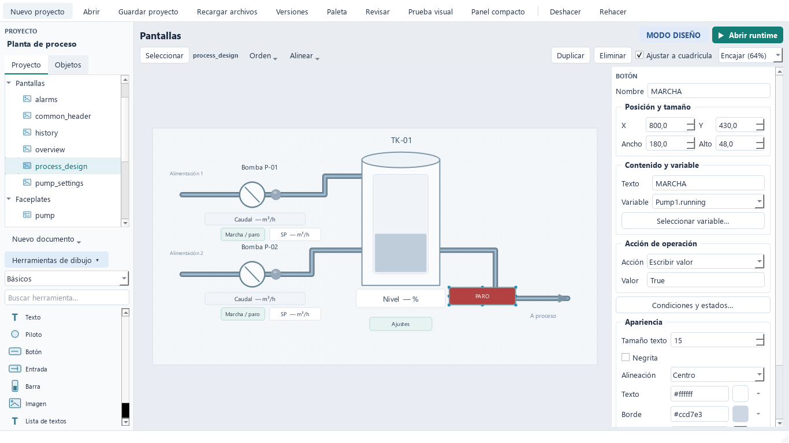
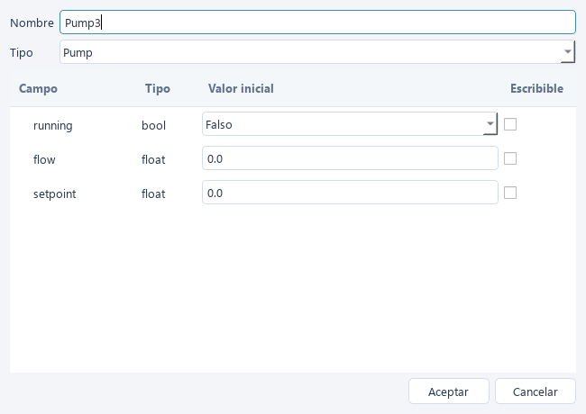

# Resolución del informe de producto

Fecha: 4 de octubre de 2026. Referencia: `artifacts/fernando-review/INFORME_FERNANDO_HURTADO.md`, conservado sin modificar.

Se han implementado correcciones y funcionalidades para los 16 puntos. La batería completa pasa: 254 pruebas en 86,23 segundos, incluidas 36 pruebas nuevas de aceptación. La guía operativa está en [VISUAL_STATES.md](VISUAL_STATES.md). Las pruebas específicas están en `tests/test_fernando_review.py`; se mantiene la suite anterior. Los requisitos que precisan personas o equipos externos se distinguen de la implementación.

| Punto | Resolución implementada | Comprobación |
| --- | --- | --- |
| F01 | Visibilidad por condición, calidad inválida configurable y parámetros de faceplate. | Clics reales de Qt alternan dos botones superpuestos; roundtrip y referencias resueltas. |
| F02 | Colores de piloto, reglas de apariencia, HEX/RGB, paleta compartida, excepciones locales, recientes y copia de colores. | Colores exactos, referencias múltiples, cambios y deshacer; previsualización con el renderizador operativo. |
| F03 | Validación antes de aceptar; error dentro del diálogo, borrador conservado y foco del campo cuando se identifica. | Variable inválida corregida en el mismo formulario; conexión vacía corregida sin reabrir. |
| F04 | Booleanos con selector y números con coma o punto decimal, sin separadores de miles. | Creación por defecto, coma española, enteros grandes y formatos ambiguos rechazados. |
| F05 | Editor de estructuras anidadas con valores/acceso por hoja; duplicado sin enlaces PLC, con revisión de enlaces originales. | Creación sin JSON, permisos por campo y duplicación sin direcciones heredadas. |
| F06 | Selector jerárquico con búsqueda y compatibilidad; revisión de mandos vacíos y rechazo de escrituras a solo lectura, también en faceplates. | Filtrado de pilotos, rechazo contextual de solo lectura y avisos de revisión. |
| F07 | Prueba visual aislada, con valores y calidad introducidos por el diseñador. | La prueba falla si se intenta construir un Runtime. No hay comunicaciones, scripts ni históricos. Adaptación deliberada a la petición previa de no crear un simulador PLC interno. |
| F08 | Diferencia con runtime visible y reinicio con cambios mediante confirmación de interrupción. | El indicador aparece tras editar y desaparece al reiniciar con la nueva copia. |
| F09 | Inspector de propiedades comunes y copia de formato sin variables ni acciones. | Una sola entrada de deshacer y conservación de enlaces y valores de mando. |
| F10 | Ocultación de diseño, bloqueo de movimiento, nombres descriptivos y grupos. | Las marcas de edición no ocultan el runtime; grupos duplicados independientes. |
| F11 | Momentáneo y valores al pulsar/soltar, habilitación, liberación por cancelación, foco, navegación y cierre. | Ratón fuera, pérdida de foco/permiso/calidad, navegación y liberación S7 TCP antes de cerrar el cliente. |
| F12 | Campos según tipo; grupos compactos y acciones antes de apariencia. | No se muestran Texto/Unidad/Decimales en piloto ni Unidad/Decimales en botón. |
| F13 | Indicador `!`, tooltip y ajuste del texto sin frases añadidas dentro del valor. | Renders con mala calidad, lectura de consigna y unidades; revisados visualmente. |
| F14 | Herramientas plegables por categorías, búsqueda con nombres completos, panel compacto y preferencias persistentes. | Renders a 1366×768 y 980×650; pruebas de acceso a todas las herramientas por búsqueda. |
| F15 | Prueba asíncrona de conexión/lectura desde el formulario y estado de runtime en conexiones. | Sonda de solo lectura, error de dirección diferenciado de conexión y cierre del cliente. |
| F16 | Traducción Qt al español, errores de números localizados y documentación de las funciones y del arranque real. | Formularios con Aceptar/Cancelar; README actualizado y ejercicio sin código. |

## Evidencia visual

`tools/capture_review_fixes.py` genera capturas en `docs/review-fixes/` sin usar un PLC ni modificar los proyectos de ejemplo. Las preferencias de las pruebas y capturas se aíslan de las del usuario. El script original del informe se conserva como reproducción histórica: sus expectativas corresponden a la interfaz anterior; la nueva aceptación está en la suite de regresión.

## Validación externa pendiente

No se ha realizado una sesión con un usuario real ni mediciones de su tiempo de trabajo. Tampoco se han validado monitores Windows reales a 125/150 % DPI, entrada táctil, lectores de pantalla, PLC físico o carga prolongada. Los renders offscreen y pruebas Qt no acreditan esas condiciones. Los mandos momentáneos incluyen tratamiento explícito de interrupciones, pero la lógica del PLC debe resolver una pérdida de comunicación o alimentación.
