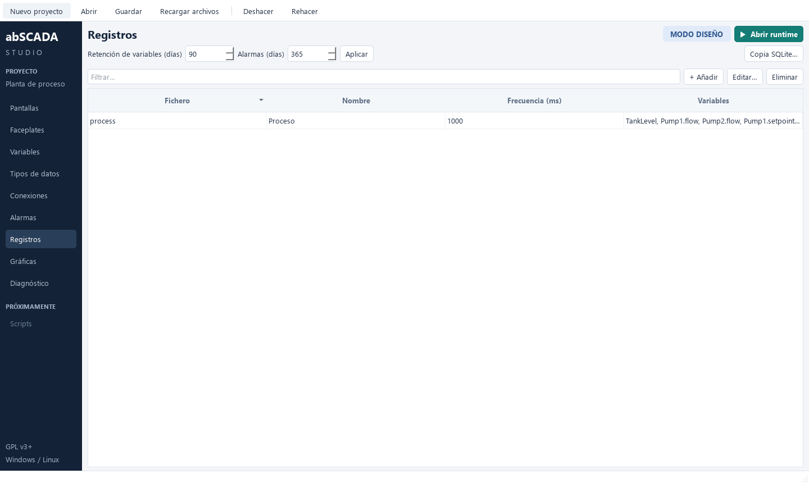
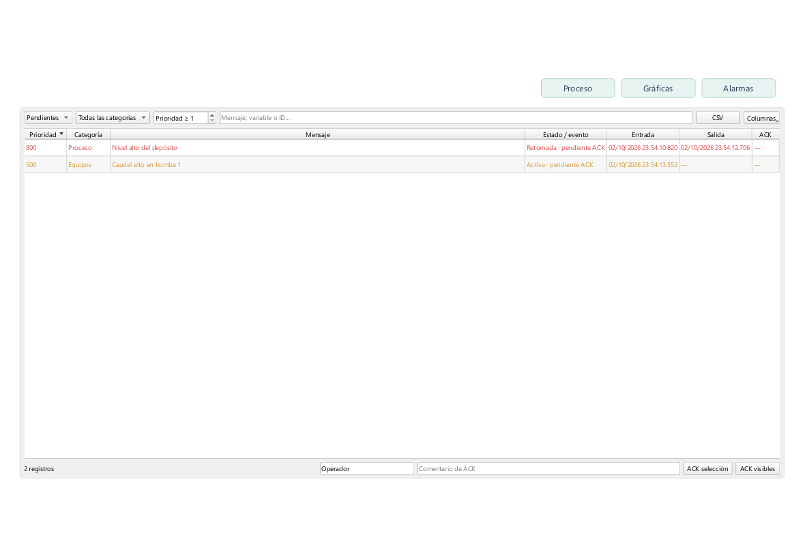
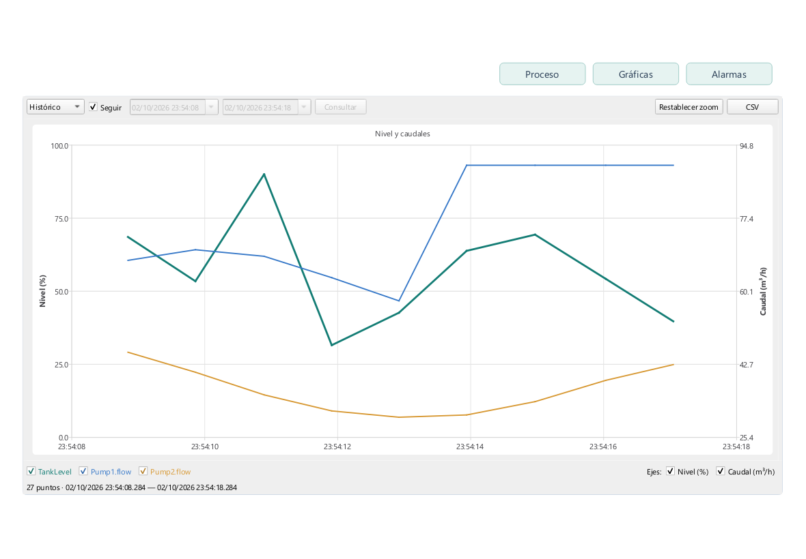

# Registros, gráficas y alarmas

## Uso en Studio

**Alarmas → Categorías:** definir ID, nombre y color. Las alarmas se asignan a una categoría; el visor puede filtrar una o varias categorías y aplica sus colores a los reconocimientos pendientes.

**Alarmas → Alarmas:** definir ID, mensaje, variable, categoría, condición, umbral, histéresis, prioridad (1000 es la más alta), retardo de entrada/salida, ACK obligatorio y habilitación. La selección de variable adapta las condiciones digitales o numéricas. Los cambios pasan por validación y deshacer/rehacer; se guardan con Ctrl+S.

**Alarmas → Visores:** definir título, modo inicial, categorías permitidas, prioridad mínima, columnas iniciales y disponibilidad del ACK. No seleccionar categorías permite mostrar todas. Este filtro y el permiso del control son configuración de interfaz, no un sistema de autorización de usuarios.

**Registros:** crear ficheros con ID, nombre, frecuencia común en milisegundos y variables incluidas. En **Variables**, el desplegable **Registro** de cada hoja permite elegir un fichero o Ninguno. Cambiarlo mueve la variable; nunca queda registrada en dos ficheros. Las estructuras conservan sus campos agrupados. El diálogo del fichero permite revisar sus variables. La retención de datos y de alarmas se configura en días.

**Pantallas:** añadir un control **Tendencia** o **Alarmas** desde la paleta. No requiere crear una configuración antes: cada nuevo control recibe una propia. Seleccionarlo y pulsar **Configurar…** en el inspector, o hacer doble clic, abre sus ajustes. El selector permite reutilizar configuraciones existentes. **Gráficas** y **Alarmas → Visores** son catálogos de esas configuraciones, no tareas de registro.

En una gráfica se eligen variables numéricas o bool, colores, grosores y ejes. Se admiten de 1 a 8 ejes con escala, lado y visibilidad configurables. Mostrar una variable en tiempo real no requiere asignarle un registro. Consultar su pasado requiere que se haya registrado durante ese periodo.

Runtime contiene únicamente la pantalla diseñada: no crea pestañas, barras de navegación ni visores automáticamente. Un botón con acción **Abrir pantalla** y destino elegido en el inspector permite navegar. El ejemplo plant tiene botones de navegación que forman parte de sus pantallas. Studio muestra representaciones de diseño sin valores en vivo.

Los visores se colocan directamente en pantallas, con un mínimo de 400 × 280; todavía no se admiten dentro de faceplates. Copia SQLite permite seleccionar el archivo de alarmas o un fichero diario y utiliza el mecanismo online de SQLite, incluyendo datos confirmados en WAL.



## Modelo de alarma

Se registra una **ocurrencia** por activación y un **evento** por transición. Una alarma que vuelve a entrar después de retornar crea una nueva ocurrencia, aunque la anterior continúe pendiente de ACK. Se conservan todas las ocurrencias pendientes.

| Estado | Condición | Reconocimiento |
| --- | --- | --- |
| Activa · pendiente ACK | Activa | Pendiente |
| Activa | Activa | Reconocida o no requiere ACK |
| Retornada · pendiente ACK | Inactiva | Pendiente |
| Cerrada | Inactiva | Reconocida o no requiere ACK |

ACK registra fecha, operador y comentario; no escribe un bit al PLC, no cambia el valor de la variable y no elimina la condición. Se admiten ACK individual, selección múltiple y ACK de las filas visibles. Una repetición del ACK es idempotente: no añade otro evento. Las ocurrencias guardan mensaje/categoría/prioridad/variable de su configuración original para que editar una definición no reescriba el pasado.

Las condiciones digitales son true/false. Las numéricas son high (≥), low (≤), igual y distinto. En high se activa al alcanzar el umbral y retorna por debajo de umbral menos histéresis. En low se activa al bajar al umbral y retorna por encima de umbral más histéresis. Igual/distinto comparan exactamente y no utilizan histéresis. Para flotantes suele ser preferible high/low.

El retardo exige que la condición se mantenga durante el tiempo configurado; el temporizador utiliza reloj monotónico. Una lectura bad/uncertain cancela retardos pendientes y conserva el estado de una alarma activa: pérdida de comunicación no se interpreta como retorno del proceso. Al recuperar calidad good se evalúa de nuevo y comienza el retardo correspondiente. Los estados activos y ACK se recuperan desde SQLite al reiniciar; las variables enlazadas comienzan uncertain hasta la primera lectura válida. Los retardos pendientes no se recuperan.

Eliminar o deshabilitar una definición no borra ocurrencias antiguas. Si una ocurrencia quedó activa al retirar su definición, se conserva como registro pendiente y puede reconocerse; no se inventa una fecha de retorno. El estado de proceso de esa ocurrencia no se reevaluará mientras la definición esté ausente/deshabilitada. Reactivarla con el mismo ID reanuda evaluación. Para conservar trazabilidad, no reutilizar IDs para alarmas de otro proceso.

El visor muestra Pendientes, Activas, Histórico y Eventos. En histórico se filtra por fecha de **entrada**; en eventos, por fecha del **evento**. Las horas se presentan en zona local, con milisegundos, y se exportan como ISO 8601 UTC. La columna Calidad representa la calidad actual de la variable si el visor está conectado al runtime; no es la calidad histórica de la ocurrencia. Las fechas seleccionadas deben ser anteriores/posteriores en ese orden. Las consultas se limitan a 2000 filas, con indicación del límite; acotar el periodo para acceder a otros datos.



## Adquisición y registro

El ciclo de conexión determina la frecuencia objetivo de lectura del equipo. El intervalo de registro determina cuándo se guarda una muestra de la última lectura disponible. Registrar cada 100 ms una variable que se adquiere cada 1000 ms no produce diez lecturas nuevas del PLC: repite el último valor, conservando su hora de adquisición para distinguirlas.

Cada fichero tiene un ciclo independiente de los demás registros y de las conexiones PLC. En cada ciclo se guarda la última muestra disponible de todas sus variables con la misma fecha de registro, incluyendo su calidad. Registrar no depende de que haya una gráfica visible. La calidad se conserva en cada ciclo; no se promete capturar transiciones más breves que el intervalo de registro.

Cada muestra tiene variable, fecha de registro, fecha de recepción de la lectura, valor JSON, valor numérico opcional y calidad. La hora de recepción no es un timestamp generado en el PLC. El registro no inventa valores ni interpola muestras al escribir SQLite.

## Gráficas en Runtime

El selector distingue **Tiempo real** y **Histórico**. Tiempo real toma muestras del runtime cada 200 ms y mantiene un buffer por control de hasta 50000 muestras por variable, limitado también por su ventana temporal. Este buffer es temporal: cambiar de pantalla recrea el control. No sustituye el registro persistente. Histórico consulta los SQLite de los días elegidos, independientemente de la pantalla que estaba abierta cuando se grabaron.

**Seguir** desplaza la ventana. Desactivarlo permite elegir inicio y fin; en modo histórico se pueden seleccionar días anteriores. El zoom fija el intervalo conservando la fuente seleccionada. Las casillas permiten ocultar curvas y ejes; ocultar un eje no oculta sus curvas. Estos ajustes de operación no modifican el proyecto.

El cursor muestra hora y muestra más cercana de cada curva visible, con calidad. Las variables bool usan una línea escalonada. La calidad mala corta la curva; no se une una lectura buena con otra atravesando el fallo. Una única muestra se representa con un punto.

Las consultas grandes se reducen por intervalos preservando primer/último dato, extremos y una muestra de mala calidad por intervalo, hasta aproximadamente 5000 puntos por curva. Esta reducción visual conserva picos y huecos representativos, pero no representa todas las transiciones originales. En modo Histórico, CSV exporta datos originales ordenados temporalmente, incluyendo calidad y ambas fechas; el límite es 100000 registros por exportación y se rechazan rangos que lo superen. No se exporta silenciosamente una versión reducida. En Tiempo real, CSV exporta las muestras del buffer mostrado.



## Persistencia y servicio

Las definiciones están en historian.json; los datos se guardan fuera de los JSON:

```text
runtime/
  scada.sqlite3                  # alarmas, eventos y auditoría
  records/
    process/
      2026-10-01.sqlite3         # variables del registro process
      2026-10-02.sqlite3
    temperatures/
      2026-10-02.sqlite3         # otro registro, con su propia frecuencia
```

Cada registro genera un SQLite por día **UTC** cuando tiene variables y recibe muestras. No se crean días vacíos ni registros sin variables. Al cambiar de día se confirma y cierra el fichero anterior y se abre el nuevo. El esquema nuevo se publica antes de permitir consultas. La fecha de adquisición original se conserva aunque la escritura pertenezca a otro día. Los visores presentan hora local; CSV usa UTC.

Las consultas recorren los días del intervalo solicitado y combinan resultados por variable. La reducción visual tiene un presupuesto compartido entre días. Un catálogo persistente de fuentes evita abrir ficheros de otros registros que no contienen la variable. También se leen los históricos anteriores en scada.sqlite3 y los ficheros de registros retirados: mover o dejar de registrar una variable no borra su pasado. La división diaria facilita retención y copias; los índices por variable/fecha siguen siendo necesarios para consultar eficientemente.

Se usa user_version=1, WAL y synchronous FULL. El archivo central conserva las ocurrencias de alarma y sus ACK entre reinicios; no se rota diariamente para mantener su estado persistente. Los archivos diarios usan el mismo esquema de repositorio, con tablas de alarma vacías.

Un único servicio es propietario del escritor SQLite y del motor de alarmas. Los trabajadores PLC solo le entregan muestras a una cola de capacidad 20000. Las consultas y exportaciones corren en trabajadores de lectura separados de Qt. Un bloqueo de archivo nativo Windows/Linux impide arrancar dos escritores para el mismo proyecto y se libera al terminar o caer el proceso.

Se confirman lotes aproximadamente cada 200 ms. ACK se confirma antes de responder al operador. Al detener se terminan adquisiciones y se vacía la cola antes de cerrar el archivo. Una caída abrupta puede perder el lote aún no confirmado; no se promete registro sin pérdidas ante fallo de alimentación. Cola llena, error SQLite o disco lleno se muestran en la barra de estado de Runtime; no se confunden con una lectura PLC fallida. Tras un fallo de archivo debe detenerse, corregirse la causa y reiniciarse el runtime.

La retención se ejecuta al arrancar y después cada hora. Elimina ficheros diarios cuyo día completo ha superado la retención, sin tocar el día abierto; si un lector o copia lo mantiene ocupado en Windows, reintenta en la siguiente pasada. En el archivo central elimina muestras antiguas del formato anterior y ocurrencias retornadas y reconocidas (o sin necesidad de ACK) que superen la retención desde su retorno, junto con sus eventos. Las alarmas activas y pendientes de ACK no se eliminan por retención. SQLite reutiliza páginas liberadas; borrar datos no reduce necesariamente el tamaño físico del archivo. No ejecutar VACUUM sobre el archivo de producción durante adquisición.

La auditoría registra inicio/parada del runtime, solicitudes de escritura y su envío/fallo. El nombre de operador del ACK es texto introducido en el control; no acredita identidad autenticada. Usuarios, roles, autorización, auditoría inmutable y firma de registros siguen pendientes.

## Límites y ampliaciones

Aún faltan autenticación, redundancia, shelving/mantenimiento de alarmas, ACK asociado a PLC, tipos/arrays ampliados, expresiones, recetas e informes. Persistencia y motor están separados de Qt para evolucionar a un runtime como servicio. No se ha validado carga industrial, equipos físicos ni todas las plataformas del workflow remoto.

SQLite WAL debe usarse en almacenamiento local. Copia SQLite permite respaldar durante ejecución; copiar únicamente el fichero .sqlite3 puede omitir transacciones confirmadas que estén en el archivo WAL. Los JSON del proyecto no contienen datos históricos.

## Referencias consultadas

- [WinCC Unified: alarm logging](https://docs.tia.siemens.cloud/r/en-us/v20/configuring-alarms-rt-unified/logging-alarms-rt-unified/basics-of-alarm-logging-rt-unified): clasificación, eventos y marcas UTC.
- [WinCC: estados de alarma](https://docs.tia.siemens.cloud/r/en-us/v20/working-with-alarms-basic-panels-panels-comfort-panels-rt-advanced-rt-professional/principles-basic-panels-panels-comfort-panels-rt-advanced-rt-professional/alarm-states-basic-panels-panels-comfort-panels-rt-advanced-rt-professional): condición y reconocimiento.
- [AVEVA: alarm event history](https://docs.aveva.com/bundle/intouch-hmi-2023r2/page/319654.html): consulta de eventos por periodo.
- [SQLite WAL](https://www.sqlite.org/wal.html): concurrencia de lectura/escritura y requisitos de almacenamiento local.
- [Qt Charts: QDateTimeAxis](https://doc.qt.io/qt-6/qdatetimeaxis-qtcharts.html): eje temporal con datos en milisegundos.

## Compatibilidad

Los proyectos antiguos con registros por variable se convierten en memoria a ficheros agrupados por intervalo. Se guardan en el nuevo formato al guardar el proyecto. El modelo nuevo registra siempre de forma cíclica; no conserva los modos antiguos por cambio/banda muerta como opciones nuevas. Los SQLite anteriores no se reescriben ni se eliminan durante esa conversión.

- [Siemens: data logging](https://docs.tia.siemens.cloud/r/en-us/v21/configuring-tags-rt-unified/logging-tags-rt-unified/basics-rt-unified/basics-of-data-logging-rt-unified): registro de variables y controles de visualización.
- [AVEVA Edge: logging and trending](https://engage.aveva.com/edge-hmi-event-logging-traceability.html): configuración de registro y visualización.
