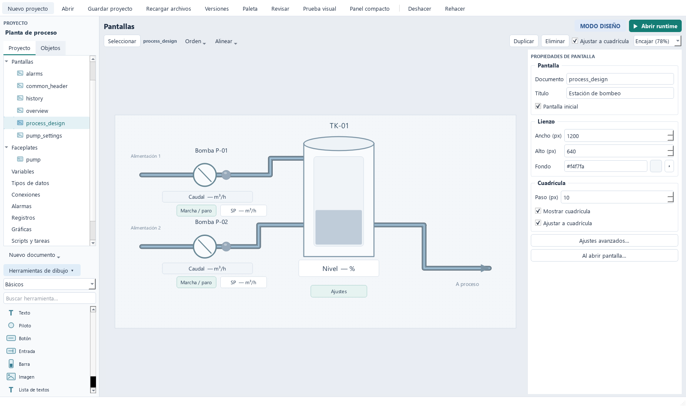
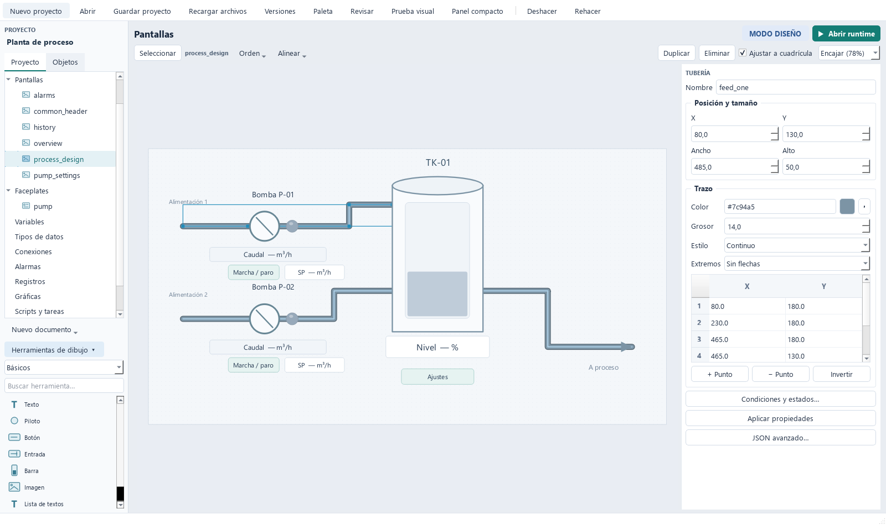

# Editor de pantallas

El espacio de trabajo utiliza un explorador único a la izquierda, el lienzo central y un inspector permanente a la derecha. Proyecto contiene todos los documentos y secciones. Objetos muestra las capas de la pantalla, desde el frente hacia el fondo, y permite seleccionar elementos solapados. La selección del lienzo y la lista se mantienen sincronizadas.

## Propiedades de pantalla

Clic en el fondo o Esc elimina la selección y muestra documento, título, ancho, alto, color de fondo, pantalla inicial, tamaño de cuadrícula, visibilidad y ajuste. El nombre de documento identifica su archivo; el título es editable. La pantalla inicial siempre está definida: se cambia marcando otra pantalla.

Los ajustes se guardan en el JSON y participan en deshacer/rehacer. El fondo y las dimensiones se aplican también al runtime. Cuadrícula y ajuste son de ingeniería. Al alejar mucho el zoom se reduce la cantidad de puntos dibujados para mantener fluidez, conservando el paso configurado para el ajuste.

## Dibujar

| Herramienta | Operación |
| --- | --- |
| Línea | Clic en origen y clic en destino |
| Polilínea | Clic por vértice; Enter, doble clic o botón derecho termina |
| Tubería | Clic por vértice, con tramos horizontales/verticales; terminar igual que una polilínea |
| Rectángulo / Elipse | Insertar desde paleta o arrastrar al lienzo; ajustar con los tiradores |

Esc cancela un trazado incompleto; Retroceso elimina su último punto. Shift restringe líneas/polilíneas a horizontal o vertical. Seleccionar vuelve a la herramienta normal. Una inserción completa constituye una única operación de deshacer.

Los trazados tienen color, grosor de 1 a 100 px, estilo continuo/discontinuo/punteado y flechas de inicio/final. La tubería tiene un acabado con borde y brillo. Los puntos se muestran como tiradores al seleccionar y como coordenadas absolutas en el inspector. + Punto inserta un punto intermedio después del seleccionado; − Punto elimina uno si quedan al menos dos; Invertir cambia el sentido del trazado. Una línea conserva dos extremos.

Arrastrar un vértice de tubería conserva la orientación de los tramos ortogonales adyacentes. La tabla permite geometría libre si se necesita. Las tuberías son elementos gráficos; no crean enlaces entre variables o equipos automáticamente. Las zonas vacías dentro de la caja del trazado dejan seleccionar los objetos que hay debajo.

## Componer

### Lista de textos

Añade Lista de textos desde la caja de herramientas, selecciona su Variable y pulsa Configurar textos… en el inspector. Cada fila relaciona un valor exacto con el texto que debe mostrar: por ejemplo 0 → Parado, 1 → En marcha, 2 → Avería. Añadir y Eliminar editan las filas; Guardar aplica el conjunto como una operación de deshacer. Cancelar descarta los cambios del diálogo.

El texto por defecto se usa cuando hay lectura válida pero ningún valor coincide. Sin variable, sin lectura o con mala calidad se muestra —. En edición aparece Lista de textos, sin valores de proceso. Se pueden ajustar fuente, negrita, alineación y colores desde Apariencia.

Admite variables int, float, bool y string, incluidas variables de estructura y parámetros de faceplate. Para bool usa 0/1 o false/true. Los valores numéricos se comparan numéricamente (1 y 1.0 son equivalentes); las cadenas distinguen mayúsculas y espacios. No se admiten valores equivalentes duplicados ni valores incompatibles con el tipo de variable. La comparación es exacta: para estados se recomienda una variable entera o booleana. El ejemplo de ajustes de bombeo incluye el estado de cada bomba.

El primer clic selecciona sin mover. Arrastrar en una pulsación posterior mueve el objeto. Ctrl permite selección múltiple; también se puede usar un rectángulo de selección o la lista Objetos. Ocho tiradores redimensionan rectángulos, elipses y controles. Los trazados se editan por vértices o mediante sus dimensiones.

Orden permite frente, fondo, subir o bajar una capa, conservando el orden relativo de una selección múltiple. Alinear opera sobre los límites conjuntos de la selección. Las flechas desplazan 1 px; Shift+flecha usa el paso de cuadrícula. Duplicar y Eliminar se aplican al lienzo; Suprimir dentro de un campo de propiedades edita ese campo.

El inspector muestra los ajustes aplicables a cada tipo. Texto, botones y entradas admiten tamaño, negrita, alineación, color de texto, fondo y borde. Las formas tienen relleno y trazo. Los visores conservan su diálogo Configurar; los faceplates conservan enlaces de parámetros y acceso por doble clic a la plantilla.

## Recorrer el lienzo

Ctrl+rueda cambia el zoom; el selector muestra el porcentaje actual y admite escalas prefijadas. Encajar ajusta la pantalla completa. El botón central permite desplazar la vista. El panel de propiedades no se oculta ni colapsa al cambiar de selección.

## Layouts y contenedores de pantallas

1. Crea las pantallas de contenido y de cabecera con sus dimensiones y controles.
2. Elige Nuevo documento → Layout. El documento aparece en Layouts y se edita con el mismo lienzo, inspector y herramientas.
3. Añade Contenedor de pantalla desde las herramientas. Asigna un nombre (por ejemplo cabecera o contenido), su posición, tamaño y Pantalla inicial.
4. En los botones de navegación elige Abrir pantalla, la pantalla destino y Abrir en → contenido. Así la cabecera permanece mientras cambia el área central.
5. Selecciona el layout, marca Pantalla inicial en sus propiedades y guarda. Abrir runtime desde Studio ejecuta el documento seleccionado; el arranque --runtime utiliza la pantalla inicial del proyecto.

Abrir en → Zona actual navega en el contenedor del botón (o en la ventana si no está dentro de uno). Ventana completa sustituye toda la composición. Un nombre de contenedor busca esa zona en la ventana actual, también en ventanas emergentes. Si no existe en esa ventana, se muestra un error sin cambiar de pantalla. Las pantallas reutilizadas en varios layouts pueden usar nombres de zona comunes.

Cada contenedor tiene su propia pantalla activa. Varios pueden mostrar la misma pantalla y navegar por separado. Comparten variables, adquisición, alarmas y registros. Admite botones, entradas, faceplates, gráficos, alarmas y ventanas emergentes. Al navegar se destruyen los controles de la pantalla sustituida y sus temporizadores; los de las otras zonas se conservan. La pantalla se ajusta al contenedor manteniendo sus proporciones y recortando al límite de la zona. Usa proporciones coincidentes para ocuparla por completo.

El editor previsualiza la composición sin valores de proceso. Edita cada pantalla desde el explorador. Los contenedores se colocan en pantallas/layouts, no en faceplates; alojan pantallas sin otros contenedores. No se permite anidar layouts. Guardado y deshacer/rehacer incluyen la composición.

## Ejemplo y comprobación

### Pantallas emergentes

Crea una pantalla y define su título, tamaño y controles desde el inspector. En el botón que la abre, elige Acción → Abrir emergente y selecciona Pantalla. La opción Bloquear la ventana principal la hace modal respecto al runtime; por defecto permite seguir operando la pantalla principal.

Cada pantalla tiene una ventana emergente como máximo: abrirla otra vez la trae al frente (los faceplates emergentes, en cambio, tienen una ventana por equipo; ver abajo). Pueden coexistir varias pantallas diferentes. Las ventanas comparten variables, comunicaciones, alarmas y registros con el runtime principal. Una acción Abrir pantalla dentro de una emergente navega en esa ventana.

Añade un botón con Acción → Cerrar emergente para cerrarla; también funciona la X del sistema. Esta acción no cierra el runtime si se usa en la ventana principal. Al cerrar el runtime se cierran todas sus emergentes. El tamaño inicial procede de las dimensiones de la pantalla, limitado por el monitor disponible, y la ventana se puede redimensionar.

En examples/plant, Ajustes abre pump_settings con las consignas S7 de las dos bombas. Las entradas se editan con doble clic.

### Faceplates emergentes

Acción → Abrir faceplate emergente abre un faceplate en su propia ventana, sin crear una pantalla por equipo. Elige el Faceplate y asigna sus parámetros. Si el botón está dentro de otro faceplate (el símbolo de una bomba, por ejemplo), los parámetros pueden reenviar los del símbolo (`$running`): cada bomba de la pantalla abre entonces su propio detalle. Título queda vacío para usar «faceplate · equipo».

Cada equipo tiene su ventana: pulsar Bomba 1 y Bomba 2 abre dos ventanas independientes, que se pueden llevar a monitores distintos. Volver a pulsar trae al frente la ya abierta. Un botón Cerrar emergente dentro del faceplate cierra solo su ventana.

Monitor fija en qué monitor se abre la ventana (también para Abrir emergente); Modo la abre maximizada o a pantalla completa; Siempre encima la mantiene por delante de otras aplicaciones.

### Monitores

Monitores… (barra superior) define en qué monitor y modo (ventana, maximizada o pantalla completa) arranca la ventana principal, y qué ventanas adicionales se abren al iniciar: por ejemplo, alarmas en el monitor 2 y vista general en el 3. El diálogo muestra los monitores detectados en el equipo de ingeniería; el puesto de operación puede tener otros.

El runtime recuerda dónde dejó el operador cada ventana y la reabre ahí. Olvidar posiciones guardadas borra esa memoria para el proyecto en este equipo.

examples/plant abre main_layout con common_header en cabecera y process_design en contenido: dos bombas, un depósito, tuberías y mandos asociados a sus variables S7. Los botones comunes cambian contenido entre proceso, equipos, gráficas y alarmas. La aplicación usa comunicación externa y no genera valores simulados internamente.

Las capturas se reproducen con tools/capture_visual_editor.py, que arranca un servidor S7 externo en un puerto efímero y guarda datos temporales. Las pruebas de interacción cubren trazado con ratón, cancelación, selección sin desplazamiento, edición de vértices, ajuste, tiradores, capas, alineación y persistencia.

