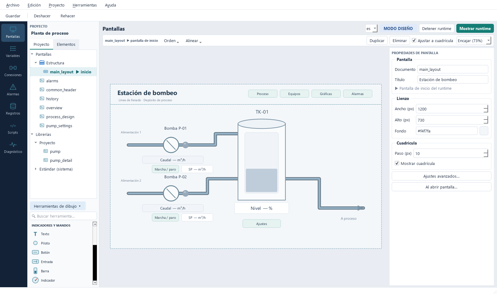

# Guía de Studio

Studio edita el proyecto; Runtime lo opera en otra ventana sobre una copia tomada al arrancar. Puedes seguir diseñando mientras funciona, pero debes reiniciar Runtime para aplicar cambios. El lienzo de Studio muestra marcadores y pilotos neutros, sin valores de proceso.

## Crear y organizar

Sin argumentos, abSCADA muestra proyectos recientes y ejemplos. Los ejemplos abiertos desde esa ventana se copian a Documentos del usuario; puedes arrancar también su PLC simulado. **Archivo → Nuevo proyecto…** crea una carpeta con un manifiesto `.abscada` y sus documentos JSON.

- Clic derecho en **Proyecto → Pantallas**: nueva pantalla, nueva carpeta, renombrar, duplicar, eliminar o elegir **Usar como pantalla de inicio**. Arrastra pantallas para moverlas entre carpetas.
- **Librerías → Proyecto**: objetos reutilizables y sus carpetas, con el mismo menú contextual.
- **Elementos**: objetos de la pantalla abierta en orden de dibujo, del fondo al frente. Permite seleccionar los que están solapados.

Una composición o layout es una pantalla normal con contenedores. No hay un tipo separado de documento ni un botón «+ Crear».

**Proyecto → Ajustes del proyecto…** reúne nombre, pantalla inicial, idiomas, dimensiones propuestas para pantallas nuevas, escalado de pantallas existentes, operación en monitores y retención. Cambiar las dimensiones propuestas no redimensiona automáticamente las pantallas existentes.

## Dibujar y editar

Las herramientas de dibujo están debajo del explorador y pueden plegarse o filtrarse. Inserta con clic o arrastra una herramienta al lienzo. El inspector siempre muestra propiedades de pantalla u objeto según la selección.

| Gesto | Resultado |
| --- | --- |
| Primer clic en un objeto | Seleccionar sin mover |
| Arrastrar un objeto ya seleccionado | Mover |
| Ctrl+clic o rectángulo de selección | Selección múltiple |
| Ocho tiradores | Redimensionar controles y formas |
| Flechas / Shift+flechas | Mover 1 px / un paso de cuadrícula |
| Ctrl+rueda / botón central | Zoom / desplazar lienzo |
| Esc o clic en el fondo | Volver a propiedades de pantalla |

**Orden**, **Alinear**, **Duplicar**, **Eliminar**, copiar/cortar/pegar y deshacer/rehacer operan sobre la selección. Los atajos del lienzo no sustituyen la edición de texto dentro de los campos. La selección múltiple muestra propiedades comunes; un valor vacío por diferencias no sobrescribe objetos hasta que lo edites.

En **Elementos**, el menú contextual permite bloquear movimiento, ocultar solo en diseño, añadir descripción, agrupar y desagrupar. Los objetos ocultos en diseño siguen disponibles en la lista y aparecen en Runtime. Los grupos son planos; duplicarlos crea un grupo independiente.

| Herramienta | Dibujo |
| --- | --- |
| Línea | Clic en origen y destino |
| Polilínea / Tubería | Clic por vértice; Enter, doble clic o botón derecho termina |
| Rectángulo / Elipse | Insertar y ajustar con tiradores |

Esc cancela un trazado incompleto; Retroceso elimina el último punto. Shift restringe líneas y polilíneas a horizontal/vertical. Las tuberías conservan tramos ortogonales al mover vértices. El inspector permite editar puntos, grosor, estilo y flechas; las tuberías no crean enlaces de proceso.

Los colores son explícitos en cada objeto y estado: `#RRGGBB` o `#AARRGGBB` (alfa al principio). Pulsa la muestra para abrir el selector RGB/alfa. No hay paleta compartida. **Orden → Copiar formato / Pegar formato** y la selección múltiple permiten repetir un estilo sin modificar variables ni acciones. Al abrir proyectos antiguos, sus referencias de paleta se convierten a HEX; el siguiente guardado retira la paleta.

## Variables y conexiones

**Variables** y su pestaña **Tipos de datos** permiten definir primitivas y estructuras anidadas. Los formularios conservan el borrador si falla la validación. Los booleanos usan Falso/Verdadero; los números admiten coma o punto decimal, sin separadores de miles ni formatos mezclados.

Cada hoja tiene valor inicial, acceso y enlace propios. **Enlace…** elige conexión y dirección con un formulario específico del protocolo. El DB pertenece a la variable S7; una conexión puede usar varios DB. **Duplicar** crea la variable sin enlaces PLC para que revises y asignes las direcciones de la copia.

En **Conexiones**, **Probar conexión** usa el borrador en una conexión de lectura independiente. **Leer variable** comprueba una dirección y muestra valor, calidad y hora. Estas pruebas no envían órdenes. Consulta [PROTOCOLS.md](PROTOCOLS.md) para direcciones y límites.

## Propiedades dinámicas y prueba visual

**Propiedades dinámicas** configura visibilidad, habilitación y apariencia según variables, sin scripts. Cada condición tiene variable, operador, valor y comportamiento sin calidad válida. Booleanos y textos admiten igual/distinto; números también comparaciones ordenadas.

La apariencia se aplica en este orden: propiedades del objeto, Normal, primer estado coincidente, Sin comunicación y Deshabilitado. Un campo vacío conserva la propiedad anterior. Los pilotos tienen colores para apagado, encendido y sin comunicación. Los objetos invisibles no reciben clics; los deshabilitados pueden mostrar un motivo de bloqueo.

**Herramientas → Prueba visual…** permite introducir valores y calidad para revisar el resultado. No crea Runtime, no conecta PLC, no ejecuta scripts ni escribe históricos; los visores se muestran como marcadores. Los botones de esa ventana no operan el proceso.

Para dos botones superpuestos MARCHA/PARO, usa la misma variable bool y posiciones. MARCHA escribe `true` y es visible cuando la variable es falsa; PARO escribe `false` y es visible cuando es verdadera. Revisa ambos estados y mala calidad en Prueba visual.

## Listas, gráficas y alarmas

**Lista de textos → Configurar textos…** relaciona valores exactos con rótulos. Acepta bool, int, float y string. Para bool sirven false/true o 0/1; no se admiten valores equivalentes duplicados. El texto por defecto se usa si hay lectura válida sin coincidencia; mala calidad muestra `—`.

Añade **Tendencia** o **Alarmas** a la pantalla y pulsa **Configurar…**, o haz doble clic. Studio crea la configuración al insertar el control y permite reutilizar otra. No hay sección Gráficas ni pestaña Visores. **Alarmas** define categorías y condiciones; **Registros** define qué variables se archivan y con qué frecuencia. Mostrar una gráfica no activa registro. Véase [OPERATIONS.md](OPERATIONS.md).

## Layouts, ventanas y monitores

1. Crea pantallas de cabecera, menú y contenido.
2. En una pantalla de composición, inserta **Contenedor de pantalla** y asigna ID, tamaño y pantalla inicial a cada zona.
3. En los botones de navegación, elige **Abrir pantalla** y **Abrir en**: nombre de contenedor, Zona actual o Ventana completa.
4. Marca la composición como pantalla de inicio desde el árbol y guarda.

Los contenedores comparten adquisición, alarmas y registros y navegan por separado. Se admite un nivel: una pantalla alojada no puede contener otros contenedores. Al navegar se destruyen los visores de la zona sustituida. Ajusta las proporciones del contenido a la zona.

**Abrir emergente** abre una pantalla en otra ventana; **Cerrar emergente** la cierra sin detener Runtime. Solo hay una ventana por pantalla de apertura; volver a abrirla la trae al frente. **Abrir faceplate emergente** abre un objeto de librería por combinación de plantilla y parámetros, permitiendo una ventana por equipo. Dentro de una plantilla puedes reenviar parámetros `$nombre`.

**Proyecto → Ajustes del proyecto… → Operación** configura monitor, modo, escalado y ventanas adicionales al arrancar. Las emergentes también tienen opciones de monitor y «siempre encima». Runtime recuerda posiciones por proyecto y puesto; si un monitor no existe, usa uno disponible. **Olvidar posiciones guardadas** borra esa memoria.

**Abrir runtime** ejecuta la pantalla seleccionada en Studio; `--runtime` utiliza la pantalla de inicio del proyecto. Cerrar la principal cierra sus emergentes y detiene comunicaciones. Guardar mientras opera no reinicia la ejecución; **Reiniciar con cambios** solicita confirmación porque interrumpe la sesión.

## Librerías

El árbol reúne **Proyecto** (editable), **Estándar** (solo lectura, incluida en la aplicación) y externas vinculadas. La estándar contiene símbolos SVG y objetos animados. Arrastra un objeto al lienzo o usa el selector con buscador; **Copiar al proyecto** crea una variante editable.

Los objetos propios viven en `faceplates/`. Sus parámetros son variables primitivas bool/int/float/string y sus elementos las referencian como `$nombre`. Cada instancia asigna todos los parámetros a variables compatibles. No se admiten objetos de librería anidados ni visores dentro de sus plantillas.

**Proyecto → Importar librería externa… → Publicar biblioteca…** genera un paquete nuevo `.abscada-library.json` con plantillas, imágenes, colores explícitos y traducciones. El exportador exige autonomía: sin variables, scripts, pantallas ni visores ocultos del proyecto de autoría. Las revisiones publicadas no se sobrescriben.

**Vincular…** fija una copia del paquete con alias y huella SHA-256; funciona sin el archivo original. **Actualizar desde…** comprueba compatibilidad antes de aplicar. Se puede deshacer y requiere guardar; un Runtime abierto conserva su versión. **Desvincular** requiere resolver las instancias que lo utilizan. La huella verifica integridad, no autoría.

El ejemplo [Autoría de equipos](../examples/library_author/README.md) permite practicar publicación y actualización. El contrato técnico está en [PROJECT_FORMAT.md](PROJECT_FORMAT.md#bibliotecas-publicadas).

## Idiomas

El idioma de Studio, el idioma de edición y el idioma del runtime son independientes. **Ayuda → Idioma / Language** cambia Studio al volver a abrirlo. **Proyecto → Ajustes del proyecto…** declara idiomas, idioma por defecto y origen del idioma inicial (proyecto, puesto o usuario).

El selector **Idioma de edición** de la barra superior cambia los textos mostrados y editados en el inspector y lienzo. Cada traducción vive junto al texto; una traducción ausente utiliza el idioma por defecto. Los identificadores, unidades y datos recibidos del PLC, como nombres de receta, no se traducen.

**Proyecto → Textos del proyecto…** reúne los textos con una columna por idioma y filtro **Sin traducir**. Los textos de librerías vinculadas y estándar son de solo lectura: modifica su origen o copia el objeto al proyecto. **Revisar el proyecto** avisa de traducciones ausentes sin impedir ejecutar.

La tabla exporta e importa **CSV UTF-8 con BOM**, compatible con Excel. `path` identifica la propiedad y las otras columnas siguen los idiomas declarados y su orden. Puedes importar parte de las filas; rutas repetidas o desconocidas se rechazan y se valida todo antes de aplicar. Las filas de solo lectura deben conservarse. Reexporta tras cambiar la estructura de los estados dinámicos.

Los ocho ejemplos incluyen español e inglés; la cervecería tiene botones ES/EN. El formato y el fallback se describen en [PROJECT_FORMAT.md](PROJECT_FORMAT.md#idiomas-y-textos).

## Guardar y versionar

Los campos del inspector y Aceptar en diálogos modifican el proyecto en memoria. **Archivo → Guardar / Ctrl+S** guarda el conjunto, incluidos scripts y traducciones. El asterisco del título indica cambios pendientes.

El guardado valida, detecta cambios externos y bloquea guardados concurrentes. Prepara copias previas y sustituye los archivos modificados; intenta restaurar si falla una escritura. No es una transacción resistente a cortes de alimentación entre archivos. Si también falla la restauración, conserva `.abscada-recovery-*` y muestra su ruta. No borres esa carpeta antes de recuperar el trabajo. Un cierre anormal puede dejar `.abscada-save.lock`; retíralo solo tras comprobar que no hay otro guardado activo.

Si VS Code u otro editor cambia archivos, Studio rechaza sobrescribirlos. Revisa tus cambios antes de **Archivo → Recargar desde disco**; no hay fusión automática. Las imágenes se copian a `assets/` al importarlas y no se eliminan al deshacer.

**Archivo → Versiones del proyecto… → Activar Git** requiere Git en PATH. Crea la versión inicial y un commit en cada guardado con cambios; no configura remoto ni hace push. El diálogo muestra las últimas 30 versiones. Si falla Git después de guardar, los archivos quedan guardados y se puede reintentar.

Se versionan diseño, scripts, imágenes, cuentas, secretos y certificados. **Protege la carpeta y el repositorio**: las contraseñas de conexión son recuperables y las claves OPC UA también viajan con el proyecto. `runtime/`, temporales y cachés quedan fuera. Véase [HARDENING.md](HARDENING.md).
