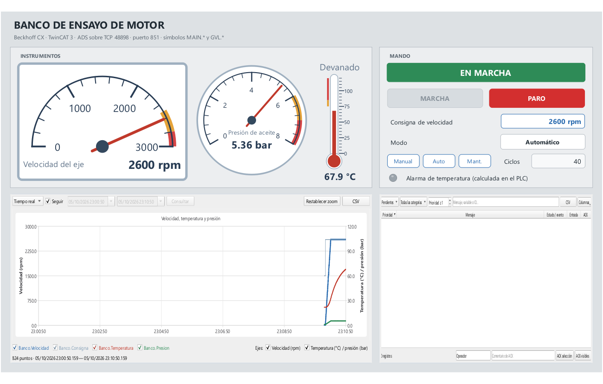

# Banco de ensayo Beckhoff · TwinCAT ADS

Ejemplo de comunicación con un **PLC Beckhoff** (CX, IPC o TwinCAT en un PC) mediante **ADS**. Es un banco de ensayo de motor con indicador de velocidad, manómetro y termómetro, mando, tendencia y alarmas.



## Probar sin PLC

En una terminal, el PLC ADS simulado:

```powershell
.venv\Scripts\python -m abscada.ads_simulator
```

En otra, el SCADA:

```powershell
.\run.ps1 examples/beckhoff
```

Pulsa **Abrir runtime**, después **MARCHA** y cambia la consigna de velocidad. El simulador acelera el eje y calienta el devanado; por encima de 85 °C activa `GVL.bAlarmaTemperatura`.

Si TwinCAT está instalado en este PC, su router ya ocupa el puerto 48898: arranca el simulador con `--port 48899` y cambia el puerto en **Conexiones**.

## Símbolos

| Variable SCADA | Símbolo del PLC | Tipo PLC | Acceso |
| --- | --- | --- | --- |
| Banco.Marcha | `MAIN.bMarcha` | BOOL | Lectura/escritura |
| Banco.Modo | `MAIN.nModo` | INT | Lectura/escritura |
| Banco.Consigna | `MAIN.rConsignaVelocidad` | REAL | Lectura/escritura |
| Banco.Velocidad | `MAIN.rVelocidad` | REAL | Lectura |
| Banco.Temperatura | `MAIN.rTemperatura` | REAL | Lectura |
| Banco.Presion | `MAIN.rPresion` | REAL | Lectura |
| Banco.Ciclos | `MAIN.nCiclos` | DINT | Lectura |
| Banco.Estado | `MAIN.sEstado` | STRING(40) | Lectura |
| Banco.AlarmaTemperatura | `GVL.bAlarmaTemperatura` | BOOL | Lectura |

## Conectar un PLC Beckhoff real

abSCADA habla ADS directamente por TCP: **no necesita TwinCAT ni el router ADS en el PC del SCADA**. A cambio, el PLC debe aceptar al SCADA como ruta, igual que con cualquier cliente ADS remoto.

1. **Datos del PLC.** Anota su IP y su **AMS Net ID**: en TwinCAT, *SYSTEM → Routes* o el icono de TwinCAT en la bandeja del PLC. Suele ser la IP seguida de `.1.1`, por ejemplo `192.168.1.50.1.1`.
2. **Ruta hacia el SCADA.** En el PLC, añade una **ruta estática** con:
   - nombre libre, por ejemplo `SCADA`;
   - AMS Net ID del PC del SCADA (por defecto, su IP + `.1.1`, por ejemplo `192.168.1.20.1.1`);
   - dirección IP del PC del SCADA y transporte TCP/IP.

   Se hace desde TwinCAT XAE (*Add Route*) o editando `StaticRoutes.xml` en el PLC.
3. **Cortafuegos.** Permite TCP 48898 entrante en el PLC.
4. **Conexión en Studio.** **Conexiones → Añadir → Beckhoff TwinCAT ADS** y rellena:

   | Campo | Valor |
   | --- | --- |
   | IP del PLC | La del paso 1 |
   | Puerto TCP | 48898 |
   | AMS Net ID del PLC | El del paso 1 |
   | Puerto ADS | **851** en TwinCAT 3 (primer runtime PLC) · **801** en TwinCAT 2 |
   | AMS Net ID local | `auto` (IP local + `.1.1`) o el que pusiste en la ruta |

5. **Variables.** En **Variables → Enlace…** escribe el símbolo completo, tal como aparece en TwinCAT (`MAIN.rVelocidad`, `GVL.aMotores[2].bMarcha`), y su tipo PLC. No distingue mayúsculas.

Si el PC del SCADA tiene TwinCAT instalado, ese router ya usa el AMS Net ID `IP.1.1`. En ese caso, pon en **AMS Net ID local** otro distinto, por ejemplo `192.168.1.20.1.2`, y crea la ruta del PLC con ese mismo valor. Así no se mezclan las dos conexiones.

El PLC debe estar en **RUN**. Si no lo está, la conexión lo indica y todas sus variables pasan a calidad *bad*.

### Direcciones sin símbolo

También se aceptan **grupo de índice : offset**, útil en TwinCAT 2 o para variables `AT %M*`:

| Escritura | Zona |
| --- | --- |
| `0x4020:0` | %MB0 (marcas) |
| `0xF020:4` | %IB4 (entradas) |
| `0xF030:4` | %QB4 (salidas) |

### Tipos admitidos

BOOL, SINT, USINT, BYTE, INT, UINT, WORD, DINT, UDINT, DWORD, LINT, ULINT, REAL, LREAL y STRING(n), con 80 por defecto. Las estructuras del PLC se leen campo a campo, enlazando cada hoja a su símbolo (`MAIN.stMotor.rVelocidad`).

### Límites actuales

- Lectura cíclica por símbolo, sin notificaciones ADS ni lecturas agrupadas (*sum commands*). Es adecuado para decenas o pocos cientos de variables por PLC.
- Sin WSTRING, arrays completos ni tipos de fecha.
- Los handles de símbolo se guardan en caché y se renuevan solos si cambia el programa del PLC.
- El simulador no reproduce un runtime TwinCAT: sirve para desarrollar y probar el SCADA.

## Regenerar

```powershell
.venv\Scripts\python tools/build_beckhoff.py --force   # conserva este README
.venv\Scripts\python tools/capture_beckhoff.py
```
