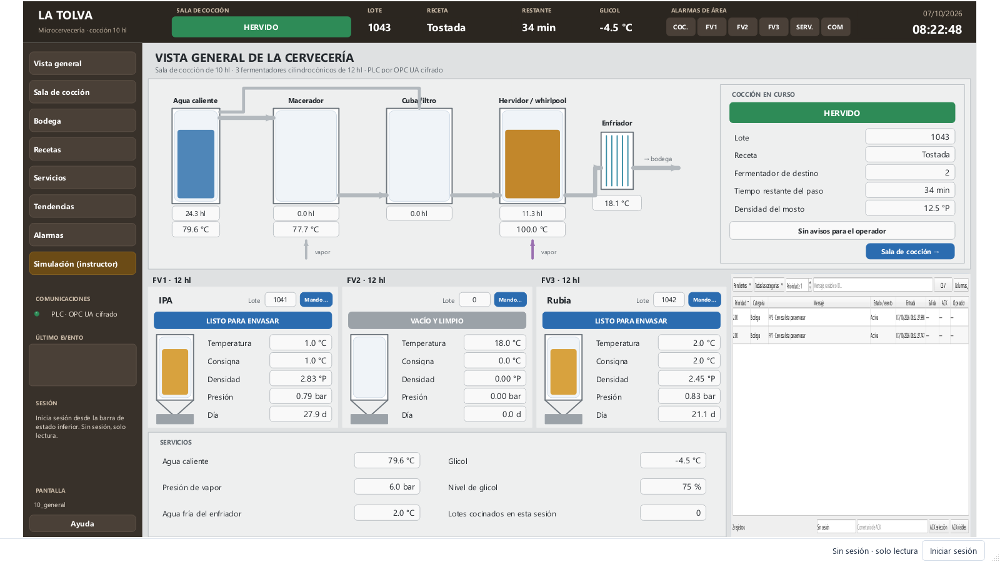
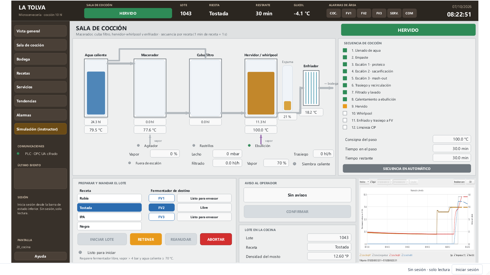
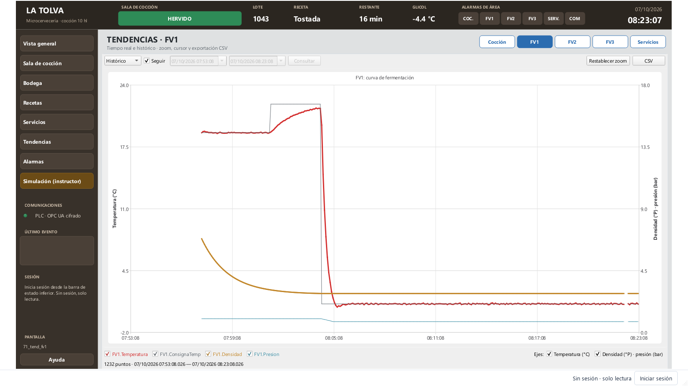
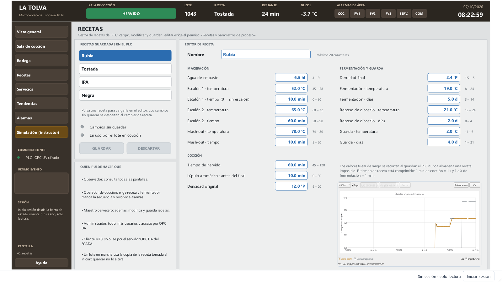

# La Tolva · SCADA de una microcervecería

Ejemplo completo de un **proceso por lotes**: una sala de cocción de 10 hl que trabaja por recetas, tres fermentadores cilindrocónicos y sus servicios. Es el complemento de la central hidroeléctrica, que es un proceso continuo, y el ejemplo de referencia para tres funciones:

- **OPC UA cifrado** hacia el PLC, con la confianza de certificados que exige una planta real.
- **Usuarios y roles** activados desde el primer arranque. Las recetas solo las modifica el maestro cervecero.
- **Servidor OPC UA** propio, para que un MES lea los datos del SCADA.

Incluye un **PLC simulado con la física de la cocción y de la fermentación**.



| | |
| --- | --- |
| Pantallas | 19: layout con cabecera y menú fijos, 13 de contenido, confirmación de aborto, panel del instructor y ayuda |
| Variables | 156, en 7 estructuras de 5 tipos |
| Conexiones | 1: el PLC de la cervecería por OPC UA (Basic256Sha256, firma y cifrado) |
| Alarmas | 35, en 4 categorías, con prioridades 200–1000 |
| Registros | 3 ficheros: cocción a 2 s, bodega a 5 s y servicios a 5 s |
| Tendencias | 11 configuraciones: cocción, perfil de receta, servicios, una curva por fermentador y una por cada pantalla de tendencias |
| Faceplates | 2: ficha de fermentador y su ventana de mando |
| Scripts | 4: inicio, reloj y comunicaciones, seguimiento de lotes y apertura de pantalla |
| Seguridad | 5 roles, 4 cuentas de demostración y el permiso `recipes` en el editor de recetas |

## La planta

```text
Agua caliente (HLT 30 hl) ─┬─▶ Macerador ─▶ Cuba filtro ─▶ Hervidor/whirlpool ─▶ Enfriador ─▶ FV1 · FV2 · FV3 (12 hl)
                           └──── agua de lavado ──┘            vapor                agua fría        camisas de glicol
Servicios: generador de vapor, depósito de agua caliente, enfriadora y depósito de glicol
```

El tiempo está **comprimido**: un minuto de receta dura un segundo en la sala de cocción y un día de fermentación dura un minuto en bodega. Una cocción completa tarda unos cuatro minutos y una fermentación entera, de 15 a 20.

## Arranque

Con el entorno del repositorio instalado (`pip install -e ".[opcua]"`), abre **dos terminales** en la raíz:

```powershell
# 1. El PLC simulado (deja esta terminal abierta)
.venv\Scripts\python -m abscada --simulador cerveceria

# 2. El SCADA
.\run.ps1 examples/brewery
```

También puedes abrirlo desde la pantalla de inicio de abSCADA con «Arrancar también su PLC simulado» marcado: trabajarás sobre una copia en tus documentos.

La primera vez hay que **confiar en el certificado del PLC**, igual que en una planta real. Las cuentas ya vienen con el proyecto.

### Confiar en el certificado del PLC

El PLC solo ofrece puntos de conexión cifrados. La primera conexión falla a propósito: el certificado del PLC queda en *Rechazados* y el SCADA marca **COM** en rojo.

1. En Studio, abre **Proyecto → Certificados OPC UA…**.
2. Comprueba que la huella del rechazado coincide con la que imprime el simulador al arrancar (`Certificado del servidor: huella …`).
3. Pulsa **Confiar en el seleccionado**. En el siguiente intento, el runtime conecta solo.

El simulador crea su certificado una vez por usuario, en la carpeta de estado de abSCADA (`%LOCALAPPDATA%\abSCADA\simuladores\cerveceria`). Mientras no lo borres, la confianza se mantiene. Igual que un PLC en puesta en marcha, el simulador acepta cualquier certificado de cliente.

### Cuentas de demostración

El proyecto exige inicio de sesión. Sin sesión, el runtime funciona en solo lectura. Las cuentas forman parte del proyecto (`users.json`, solo con la huella scrypt de cada contraseña) y estas vienen ya creadas:

| Usuario | Contraseña | Rol | Para qué |
| --- | --- | --- | --- |
| `admin` | `Tolva-Admin-2026` | Administrador | Gestionar cuentas y todo lo demás |
| `maestro` | `Tolva-Maestro-2026` | Maestro cervecero | Modificar y guardar recetas |
| `operador` | `Tolva-Operador-2026` | Operador de cocción | Llevar la cocción y reconocer alarmas |
| `mes` | `Tolva-MES-cliente` | Cliente MES (OPC UA) | Leer el SCADA desde otro programa |

Son contraseñas **públicas**, de demostración. Si partes de este ejemplo para algo real, cámbialas en **Proyecto → Usuarios y roles… → Cuentas** (o crea cuentas nuevas y borra estas).

## Roles y permisos

| Rol | Mandos y consignas | Reconocer alarmas | Recetas | Gestionar usuarios | OPC UA |
| --- | :-: | :-: | :-: | :-: | :-: |
| Observador | | | | | |
| Operador de cocción | ✔ | ✔ | | | |
| Maestro cervecero | ✔ | ✔ | ✔ | | |
| Administrador | ✔ | ✔ | ✔ | ✔ | ✔ |
| Cliente MES (OPC UA) | | | | | ✔ |

El permiso **«Recetas y parámetros de proceso»** (`recipes`) no lo pide ningún control por defecto. En este proyecto lo llevan las entradas del editor de recetas y sus botones GUARDAR y DESCARTAR (`"permission": "recipes"`). Cualquiera puede consultar las recetas, y elegir cuál se cocina es tarea del operador.

Cada orden queda en la auditoría con el usuario que la dio y su origen: HMI, OPC UA o script.

## Pantallas

| Menú | Contenido |
| --- | --- |
| Vista general | Sinóptico de la sala de cocción, el lote en curso, las fichas de los tres fermentadores, servicios y alarmas activas |
| Sala de cocción | Depósitos y líneas animadas, **secuencia de 12 pasos**, receta y fermentador de destino, INICIAR / RETENER / REANUDAR / ABORTAR, avisos al operador y tendencia de maceración |
| Bodega | Ficha de cada fermentador con su válvula de glicol, su modo y la **curva de fermentación** |
| Recetas | Gestor de recetas del PLC: cargar, editar, guardar o descartar, con el rango de cada parámetro |
| Servicios | Agua caliente, generador de vapor, glicol y agua fría |
| Tendencias | Cocción, FV1, FV2, FV3 y servicios |
| Alarmas | Activas, histórico y eventos |
| Simulación | Panel del instructor para provocar averías |



### Convenciones de color

Fondo gris neutro y color solo cuando significa algo (ISA-101): **verde** en marcha, **gris** parado, **ámbar** retenido o pendiente del operador, **rojo** alarma y **azul** mandos y consignas editables. Las líneas de proceso se colorean mientras circulan: azul el agua, ámbar el mosto, dorado la cerveza y violeta el vapor.

## Operación

**Cocción.** En *Sala de cocción*, elige la receta y un fermentador **libre** y pulsa **INICIAR LOTE**. Solo se habilita con vapor por encima de 4 bar y agua caliente a 70 °C o más. El PLC copia la receta en ese momento: si después alguien la modifica, el lote en curso no cambia.

| Paso | Qué hace el PLC |
| --- | --- |
| 1 · Llenado de agua | Llena el macerador con agua caliente mezclada hasta la temperatura de empaste |
| 2 · Empaste | **Espera** a que el operador añada la malta y confirme |
| 3–5 · Escalones | Calienta con vapor y mantiene cada escalón el tiempo de la receta. El primero se salta si dura 0 min |
| 6 · Trasiego y recirculación | Pasa la masa a la cuba filtro y recircula 5 min |
| 7 · Filtrado y lavado | Lleva el mosto al hervidor mientras lava el grano con agua caliente. Los rastrillos actúan si se colmata el lecho |
| 8 · Calentamiento | Lleva el hervidor a ebullición |
| 9 · Hervido | Cuenta solo mientras hierve y **pide** el lúpulo de amargor y el aromático |
| 10 · Whirlpool | Reposo de 15 min |
| 11 · Enfriado y trasiego | Pasa el mosto por el enfriador hasta el fermentador a la temperatura de siembra |
| 12 · Limpieza CIP | Limpieza de 10 min y vuelta a reposo |

**RETENER** congela la secuencia (calentamientos, trasiegos y tiempos) y **REANUDAR** la continúa. **ABORTAR** pide confirmación y manda a desagüe todo el mosto de la sala de cocción, y el del fermentador si se estaba llenando.

**Fermentación.** Cada fermentador sigue la receta del lote: **fermentación** a su temperatura hasta alcanzar los días y la densidad final, **reposo de diacetilo** (el glicol cierra y la temperatura sube libremente), **cold crash** hasta la temperatura de guarda, **guarda** y **listo para envasar**. En «Mando…» puedes pasar la temperatura a consigna manual o, al final, **TRASEGAR A ENVASADO** para dejar el fermentador libre.

Al arrancar, el FV1 tiene una IPA en fermentación y el FV2 una Rubia en guarda. El FV3 está libre.



## Recetas

| Receta | Escalones | Hervido | DO → DF | Fermentación | Diacetilo | Guarda |
| --- | --- | --- | --- | --- | --- | --- |
| Rubia | 52 °C 10 min · 65 °C 60 min · 78 °C 10 min | 60 min | 12,0 → 2,4 °P | 19 °C 5 d | 21 °C 2 d | 2 °C 4 d |
| Tostada | 68 °C 60 min · 78 °C 10 min | 60 min | 13,5 → 3,2 °P | 18 °C 6 d | 20 °C 2 d | 2 °C 7 d |
| IPA | 65 °C 75 min · 77 °C 10 min | 75 min | 15,5 → 2,8 °P | 19 °C 6 d | 22 °C 3 d | 1 °C 5 d |
| Negra | 67 °C 60 min · 78 °C 10 min | 60 min | 12,5 → 3,5 °P | 18 °C 5 d | 20 °C 1 d | 3 °C 5 d |

El editor sigue el patrón habitual de un gestor de recetas en PLC. Al elegir una receta, se carga en un **búfer**; las modificaciones se escriben en ese búfer y **GUARDAR** lo copia a la receta almacenada. Los valores fuera de rango se recortan al guardar, así que el PLC nunca almacena una receta imposible.



## Servidor OPC UA para el MES

El proyecto activa el servidor OPC UA de abSCADA en el **puerto 4850**: `opc.tcp://<equipo>:4850/abscada`, con firma y cifrado y sin acceso anónimo. Publica todas las variables en `Objects/abSCADA`. Para leerlas con UaExpert u otro cliente:

1. Conecta con la cuenta `mes`. Su rol solo tiene «Acceso por OPC UA», así que el acceso es de solo lectura.
2. La primera vez, el certificado del cliente queda en *Rechazados* de **Proyecto → Certificados OPC UA…**. Confía en él y el cliente también tendrá que confiar en el del SCADA.

Para escribir desde OPC UA, el rol necesita además «Mandos y consignas».

## Ejercicios con el panel del instructor

1. Inicia sesión como `operador`. En *Sala de cocción*, elige **Tostada**, el **FV3** e **INICIAR LOTE**.
2. Confirma la malta en el empaste y los lúpulos cuando lo pida el aviso ámbar.
3. Durante el hervido, activa **Espuma en el hervor**. Reconoce la alarma y observa cómo el PLC baja el vapor del 70 al 40 %.
4. Con el lote ya en bodega, activa **Fallo de la enfriadora de glicol**. El glicol pasa de 0 °C, los fermentadores se desvían de su consigna y saltan sus alarmas.
5. Como `operador`, intenta cambiar una receta: abSCADA te pide una sesión con el permiso de recetas. Hazlo como `maestro`.
6. Activa **Levadura inactiva** en un fermentador que esté en fermentación: al cabo de un día (un minuto), salta *Fermentación parada*.
7. Cuando un fermentador llegue a **Listo para envasar**, trasiégalo desde su «Mando…».

## Mapa de comunicaciones

Las direcciones salen de [`brewery_map.py`](../../src/abscada/simulators/brewery_map.py), que comparten el generador del proyecto y el simulador.

| Conexión | Protocolo | Dirección | Ciclo | Contenido |
| --- | --- | --- | --- | --- |
| PLC_Cerveceria | OPC UA, Basic256Sha256, firma y cifrado | `opc.tcp://127.0.0.1:4841/latolva` | 1000 ms | Objetos `Cocina`, `FV1`–`FV3`, `Servicios` y `Recetas` |

Cada variable es un nodo `nsu=urn:latolva:plc;s=<objeto>.<campo>`, por ejemplo `nsu=urn:latolva:plc;s=FV1.Temperatura`. La forma `nsu=` resuelve el índice del namespace al conectar, así que el enlace sigue siendo válido aunque el servidor reordene su tabla de namespaces. Los tipos son los de un PLC: REAL como `Float`, DINT como `Int32`, BOOL y STRING.

Las órdenes (`Orden…`) son **pulsos**: el PLC las lee y las vuelve a poner a falso.

Para una planta real, cambia el endpoint y adapta los NodeId al programa del PLC. Las pantallas no necesitan cambios.

## Simplificaciones

Este ejemplo muestra cómo es un SCADA cervecero; no es un sistema certificado.

- Los tiempos están comprimidos (1 min de receta = 1 s y 1 día de fermentación = 1 min).
- El modelo es didáctico. La atenuación sigue una curva de primer orden y el calor de fermentación, el glicol y el CO₂ siguen balances sencillos, sin pretender reproducir una levadura concreta.
- abSCADA **no es una función de seguridad**. Las válvulas de seguridad, los enclavamientos de vapor y las protecciones viven en el PLC y en el campo, nunca en el SCADA.

## Regenerar y comprobar

```powershell
.venv\Scripts\python tools/build_brewery.py --force     # regenera examples/brewery (borra cambios; conserva este README)
.venv\Scripts\python tools/capture_brewery.py           # capturas con datos en vivo en artifacts/brewery
.venv\Scripts\python -m pytest tests/test_brewery.py    # proyecto, cocción, fermentación, recetas, roles y OPC UA
```

## Idiomas y colores

El proyecto incluye español e inglés. Cambia el idioma de edición en Studio y el de operación desde Runtime; las traducciones se guardan junto a cada texto. Cada objeto utiliza colores HEX explícitos, editables en sus propiedades. Véase [la guía de Studio](../../docs/STUDIO.md#idiomas).
