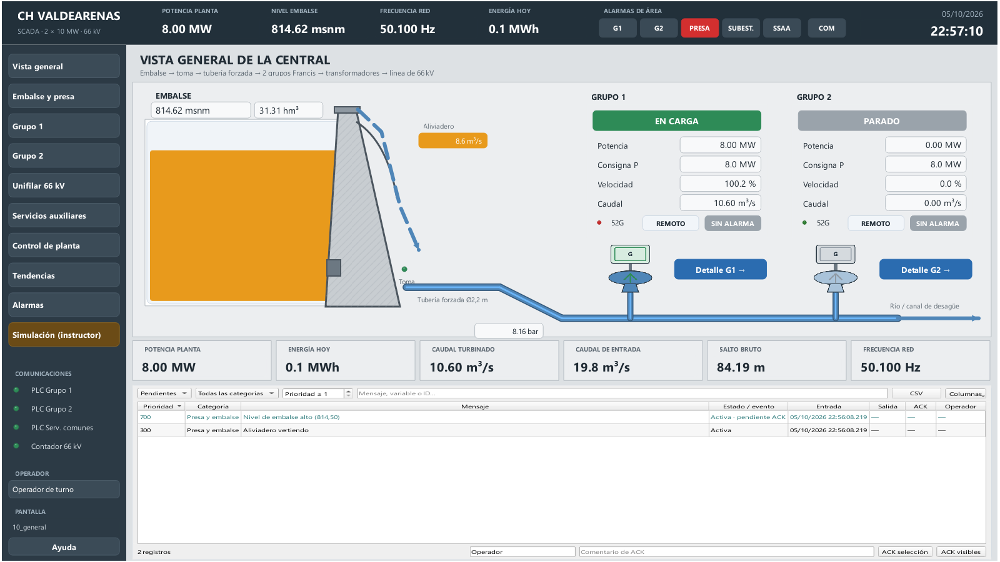
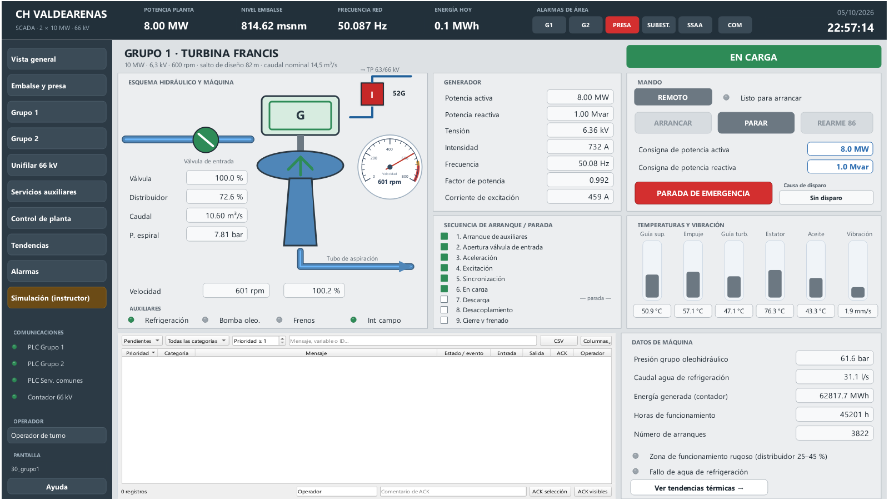
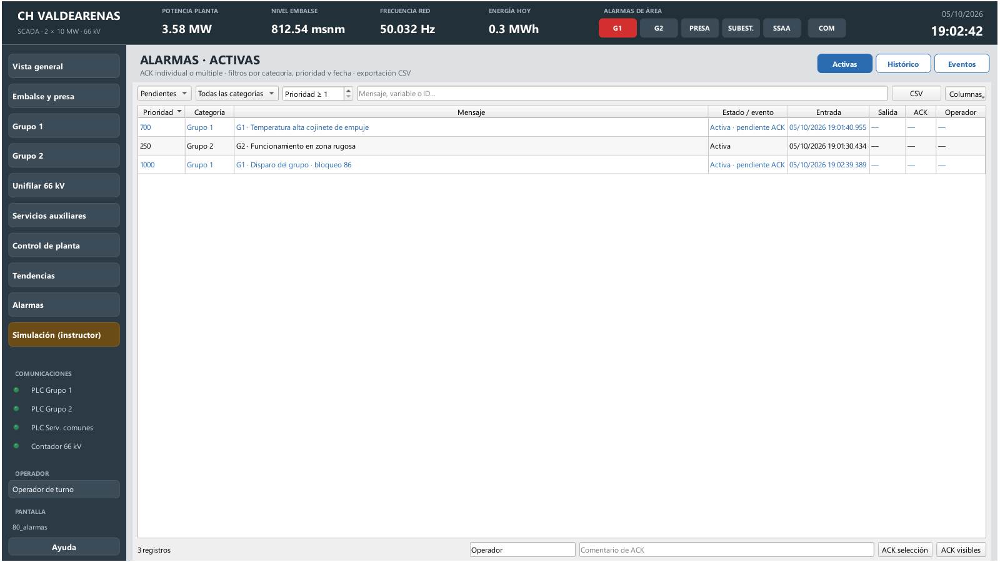

# CH Valdearenas · SCADA de una central hidroeléctrica

Proyecto de ejemplo completo y realista: una **central hidroeléctrica a pie de presa con dos grupos Francis de 10 MW**, operada desde abSCADA como lo haría un centro de control. Incluye un **PLC simulado con la física de la planta** para operarla sin equipos reales.



| | |
| --- | --- |
| Pantallas | 23 (layout con cabecera y menú fijos, 16 de contenido, 3 emergentes y una ventana de alarmas para otro monitor) |
| Variables | 173, en 6 estructuras |
| Conexiones | 4: un PLC S7 por grupo, un PLC S7 de servicios comunes y el contador fiscal por Modbus TCP |
| Alarmas | 43, en 6 categorías, con prioridades 200–1000 |
| Registros | 4 ficheros (eléctrico 2 s, térmico 5 s, embalse 10 s, estados 5 s) |
| Tendencias | 5 configuraciones |
| Faceplates | 6: resumen de grupo, interruptor, bomba y compuerta, y dos en ventana propia: mando de grupo y detalle de bomba |
| Scripts | 4: inicio, ciclo de 1 s, control de planta cada 2 s y apertura de pantalla |

## La planta

```text
Embalse (NMN 815 msnm) ── toma ── tubería forzada Ø2,2 m ──┬── VE ── G1 Francis 10 MW ── 52G1 ── TP1 66/6,3 kV ──┐
   │                                                       └── VE ── G2 Francis 10 MW ── 52G2 ── TP2 66/6,3 kV ──┤
   └── aliviadero: 2 compuertas Taintor 8 × 6 m                                                 barras 66 kV ── 52L ── línea
                                                                                                        └── TSA ── 400 V ── diésel
```

Salto de diseño 82 m · caudal nominal 14,5 m³/s por grupo · generadores de 6,3 kV y 600 rpm · servicios auxiliares de 400 V con grupo diésel · corriente continua de 125 V con baterías.

## Arranque

Con el entorno del repositorio instalado (`pip install -e ".[s7,modbus]"`), abre **dos terminales** en la raíz:

```powershell
# 1. Los PLC simulados (deja esta terminal abierta)
.venv\Scripts\python -m abscada --simulador hydro

# 2. El SCADA
.\run.ps1 examples/hydro
```

En Studio pulsa **Abrir runtime** (o arranca solo la operación con `python -m abscada examples/hydro --runtime`). Sin el simulador, todas las señales aparecen con calidad *bad* y la cabecera marca **COM** en rojo, como en una planta real sin comunicaciones.

Para que las tendencias tengan **una semana de histórico**, con el Runtime cerrado ejecuta una vez:

```powershell
.venv\Scripts\python tools/seed_hydro_history.py
```

Los datos son **sintéticos** (una muestra por minuto, con un despacho diario plausible) y quedan marcados así en la auditoría de cada fichero. La herramienta no sobrescribe días que ya tengan datos.

## Pantallas

| Menú | Contenido |
| --- | --- |
| Vista general | Sinóptico embalse → tubería → grupos, fichas de grupo, indicadores clave y alarmas activas |
| Embalse y presa | Sección de la presa con cotas, balance de caudales, aliviadero en automático/manual, compuerta de toma |
| Grupo 1 / Grupo 2 | Esquema de máquina, generador, **secuencia de arranque/parada paso a paso**, mando, temperaturas y vibración, alarmas del grupo |
| Unifilar 66 kV | Línea, 52L, barras, transformadores, 52G, generadores, servicios auxiliares y contador fiscal, coloreados por tensión |
| Servicios auxiliares | Oleohidráulicos, refrigeración, drenaje, aire comprimido, 125 Vcc y 400 V |
| Control de planta | Reparto de potencia entre grupos y regulación del nivel del embalse |
| Tendencias | Producción, embalse, térmico G1/G2 y eléctrico |
| Alarmas | Activas, histórico y eventos, con ACK y exportación CSV |
| Simulación | Panel del instructor para provocar averías (solo existe en formación) |



### Convenciones de color

Fondo gris neutro y color solo cuando significa algo (estilo de HMI de alto rendimiento, ISA-101): **verde** en marcha, **gris** parado, **ámbar** transición o aviso, **rojo** disparo o alarma. En el unifilar se usa la convención eléctrica habitual: interruptor **rojo = cerrado**, **verde = abierto**, y conductor **azul = en tensión**. Las consignas editables tienen borde azul.

## Operación

**Arranque de un grupo.** Con el grupo en REMOTO y el piloto *Listo para arrancar* encendido (presión de aceite, toma abierta, red presente y sin bloqueo), pulsa **ARRANCAR**. El PLC recorre la secuencia real:

| Paso | Qué hace el PLC |
| --- | --- |
| 1 · Arranque de auxiliares | Refrigeración y grupo oleohidráulico en servicio, quita frenos |
| 2 · Apertura válvula de entrada | Bypass, equilibrado de presiones y apertura de la válvula mariposa |
| 3 · Aceleración | Abre el distribuidor al 15 % y regula la velocidad al 100 % |
| 4 · Excitación | Cierra el interruptor de campo y sube la tensión a 6,3 kV |
| 5 · Sincronización | Iguala frecuencia y fase con la red y cierra el 52G |
| 6 · En carga | El regulador lleva la potencia a la consigna |

**Parada.** **PARAR** descarga el grupo (7), abre el 52G y el campo (8), cierra distribuidor y válvula y frena por debajo del 20 % de velocidad (9).

**Disparo.** La **PARADA DE EMERGENCIA** (con confirmación) o cualquier protección provoca un cierre rápido y deja el grupo **bloqueado (86)**. La causa aparece en el panel de mando. Cuando el grupo está parado, **REARME 86** lo devuelve a reposo.

**Protecciones simuladas:** cojinetes de guía > 80 °C y de empuje > 85 °C, estator > 130 °C, vibración > 7,1 mm/s, presión de aceite < 45 bar, sobrevelocidad > 115 % y pérdida de red con el grupo acoplado. Las alarmas saltan antes (70/75/110 °C, 4,5 mm/s, 52 bar).

**Control de planta.** Activa el *control conjunto*: el script `control_planta.py` reparte la consigna de planta entre los grupos acoplados en remoto (de 2 a 10 MW cada uno). Con la *regulación de nivel* activa, la consigna de planta se ajusta para mantener el embalse en la cota deseada.

**Aliviadero.** En automático, el PLC del servicio común abre las compuertas a partir de 814,60 msnm. En manual, el operador escribe la consigna de apertura de cada compuerta.

## Ventanas y varios monitores

El runtime arranca maximizado. Desde ahí, el operador abre ventanas independientes que puede llevar a otros monitores. Todas comparten las comunicaciones, las alarmas y los registros de la ventana principal.

- **Mando de grupo.** El botón **Mando…** de cada ficha de la vista general abre el estado, la consigna y ARRANCAR / PARAR / REARME 86 de ese grupo. La ficha reenvía sus parámetros al faceplate `mando_grupo`, así que G1 y G2 abren ventanas distintas: puedes tener las dos abiertas a la vez.
- **Detalle de bomba.** En *Servicios auxiliares*, un clic en cualquier bomba (aceite G1/G2, drenaje 1/2, compresor) abre su estado y su fallo en una ventana propia, con el título del equipo.
- **Alarmas en otro monitor.** **⧉ Monitor 2**, en las pantallas de alarmas, abre `05_ventana_alarmas` maximizada en el monitor 2. Sus pestañas Activas / Histórico / Eventos navegan dentro de esa ventana. Con un solo monitor, se abre en el principal.

El runtime recuerda dónde deja el operador cada ventana. Para un puesto con tres monitores que arranque ya repartido, añade en `valdearenas.abscada` (o desde **Proyecto → Ajustes del proyecto… → Operación**):

```json
"display": {
  "main": {"monitor": 1, "mode": "maximized"},
  "windows": [
    {"screen": "05_ventana_alarmas", "monitor": 2, "mode": "maximized"},
    {"screen": "40_unifilar", "monitor": 3, "mode": "maximized"}
  ]
}
```

El ejemplo no lo trae activado para que funcione igual en un portátil con una sola pantalla.

## Ejercicios con el panel del instructor



1. Arranca el Grupo 1 y sigue la secuencia hasta **EN CARGA**.
2. Baja su consigna a 3,5 MW: el distribuidor entra en la **zona rugosa** (25–45 %) y aparece el aviso.
3. Activa *Calentamiento de cojinete de empuje*: alarma a 75 °C, **disparo** a 85 °C. Reconoce las alarmas con tu nombre y un comentario.
4. Quita la avería, espera a que se pare y pulsa **REARME 86**.
5. Con los dos grupos en carga, provoca una **pérdida de red**: rechazo de carga, sobrevelocidad, disparo de ambos grupos y arranque del diésel. Restablece la red, cierra el **52L** desde el unifilar y rearma.
6. Provoca una **avenida**: sube el embalse, el aliviadero abre solo y saltan las alarmas de presa.

## Mapa de comunicaciones

Las direcciones salen de [`tools/hydro_map.py`](../../tools/hydro_map.py), compartido por el generador del proyecto y el simulador.

| Conexión | Protocolo | Dirección | Ciclo | Contenido |
| --- | --- | --- | --- | --- |
| PLC_G1 | S7 | 127.0.0.1:1102, rack 0 slot 1 | 250 ms | DB1, 116 bytes: órdenes, estados, analógicas y contadores del grupo 1 |
| PLC_G2 | S7 | 127.0.0.1:1103, rack 0 slot 1 | 250 ms | DB1, mismo mapa que el grupo 1 |
| PLC_SSCC | S7 | 127.0.0.1:1104, rack 0 slot 1 | 500 ms | DB1: embalse, aliviadero, toma, subestación y auxiliares |
| Contador_66kV | Modbus TCP | 127.0.0.1:1502, unit 1 | 1000 ms | Input registers float32 (P, Q, U, f, cos φ) y uint32 (kWh exportados/importados) |

Mapa principal de cada grupo (DB1):

| Dirección | Señal | Acceso |
| --- | --- | --- |
| %DB1.DBX0.0 – X0.3 | Órdenes de arranque, parada, emergencia y rearme (pulsos que el PLC borra) | Escritura |
| %DB1.DBX0.4 – X1.7 | Remoto, listo, acoplado, disparo, válvula, 52G, campo, frenos, refrigeración, bomba de aceite, alarma de grupo | Lectura |
| %DB1.DBD4 | Paso de la secuencia (DINT) | Lectura |
| %DB1.DBD8 / DBD12 | Consignas de P (MW) y Q (Mvar), REAL | Escritura |
| %DB1.DBD16 – DBD96 | Velocidad, distribuidor, válvula, caudal, P, Q, U, I, f, cos φ, temperaturas, vibración, presiones, excitación | Lectura |
| %DB1.DBD100 – DBD112 | Energía, horas, arranques y causa de disparo | Lectura |

Para una planta real, cambia las IP y adapta las direcciones al programa de cada PLC. Las pantallas no necesitan cambios.

## Simplificaciones

Este ejemplo enseña cómo es un SCADA hidroeléctrico; no es un sistema certificado.

- Los tiempos están **comprimidos**: un arranque completo dura unos 40 s, en vez de varios minutos.
- El embalse responde unas **200 veces más rápido** que en la realidad, para que los cambios de nivel se vean.
- El modelo es didáctico: rendimiento, temperaturas y vibraciones siguen tendencias plausibles, sin pretender reproducir una máquina concreta.
- abSCADA **no es una función de seguridad**: en una central real, las protecciones y los enclavamientos viven en los relés y en el PLC, nunca en el SCADA.
- La parada de emergencia del SCADA es una orden más, no sustituye a la seta cableada.

## Regenerar y comprobar

```powershell
.venv\Scripts\python tools/build_hydro.py --force   # regenera examples/hydro (borra cambios)
.venv\Scripts\python tools/capture_hydro.py         # capturas con datos en vivo en artifacts/hydro
.venv\Scripts\python -m pytest tests/test_hydro.py  # proyecto, secuencias, TCP, alarmas e histórico
```

## Idiomas y colores

El proyecto incluye español e inglés. Cambia el idioma de edición en Studio y el de operación desde Runtime; las traducciones se guardan junto a cada texto. Cada objeto utiliza colores HEX explícitos, editables en sus propiedades. Véase [la guía de Studio](../../docs/STUDIO.md#idiomas).
